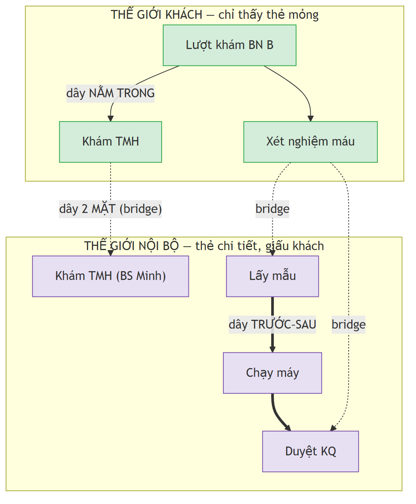

# DB hoạt động thế nào — giải thích bằng tiếng người

> Trang này KHÔNG có thuật ngữ. Đọc 3 phút là hiểu. Chi tiết kỹ thuật xem [db_design_v1.md](db_design_v1.md).

---

## 1 câu cốt lõi

> **Mọi việc trong phòng khám — cả lượt khám, một lần xét nghiệm, hay một bước nhỏ — đều ghi thành MỘT tấm thẻ giống hệt nhau. DB chỉ làm 2 việc: lưu các thẻ, và nối chúng bằng dây.**

Hết. Mọi thứ còn lại là chi tiết của câu này.

---

## Hình dung: một xấp thẻ + ba loại dây

**Cái hộp đựng thẻ = bảng `node`.** Mỗi việc là 1 thẻ, bất kể to nhỏ. Trên thẻ ghi: *mã thẻ · loại việc · đang làm hay xong · khách có được thấy không*.

**Ba loại dây nối thẻ:**

| Dây | Nghĩa đời thường | Ví dụ | Bảng |
|---|---|---|---|
| **NẰM TRONG** | thẻ nhỏ nằm trong thẻ to | "Khám TMH" nằm trong "Lượt khám" | `node_link` |
| **TRƯỚC–SAU** | việc này xong mới tới việc kia | "có kết quả XN rồi mới kê đơn" | `node_dependency` |
| **2 MẶT** | thẻ khách thấy ↔ thẻ thật bên trong | "Xét nghiệm máu" (khách) ↔ lấy mẫu + chạy máy + duyệt (nội bộ) | `task_bridge` |

---

## Hai thế giới: thẻ khách vs thẻ nội bộ

Mỗi thẻ có dấu **"khách được thấy"** hay **"chỉ nội bộ"**.
- Khách mở app → chỉ thấy thẻ "khách thấy" → danh sách mỏng: *vào phòng, nhận kết quả*.
- Nhân viên → thấy thẻ nội bộ chi tiết.

→ Cùng một việc tách thành 2 thẻ để **giấu phần ruột** với khách. (Đây là điều anh D muốn: "khách chỉ biết vào phòng + nhận kết quả".)

---

## Vậy toàn bộ phần mềm rút lại còn

- Tạo việc mới = **thêm 1 thẻ**
- Việc lồng việc = **nối dây NẰM TRONG**
- Việc trước–sau = **nối dây TRƯỚC–SAU**
- Màn hình khách = **lọc thẻ "khách thấy"** · Màn hình phòng = **lọc thẻ nội bộ**

Lúc nào cũng chỉ là: **thêm thẻ + nối dây + đổi trạng thái thẻ.**

---

## Nói cho anh D trong 30 giây

1. Em không làm mỗi nghiệp vụ một bảng. Em coi **mọi việc là một thẻ giống nhau**, lưu chung bảng `node`.
2. Việc **lồng nhau** nối bằng `node_link`; việc **trước–sau** nối bằng `node_dependency`.
3. Thẻ **khách** và thẻ **nội bộ** là hai bộ riêng, nối bằng `task_bridge` — khách chỉ thấy thẻ của khách.
4. Nhờ vậy **thêm loại việc mới chỉ là thêm dữ liệu, không phải đập bảng**.

---

## Anh D có thể hỏi vặn — trả lời sẵn

**"Sao không làm mỗi thứ một bảng cho dễ đọc?"**
→ Vì phòng khám đẻ loại việc mới liên tục (lịch tiêm, chuyển viện, gói khám...). Mỗi loại một bảng thì cứ thêm nghiệp vụ là phải đập DB. Kiểu thẻ chung: thêm loại việc chỉ là thêm 1 dòng cấu hình. Đổi lại, đọc khó hơn chút — bù bằng các "view nghiệp vụ" đặt tên dễ hiểu.

**"Thế làm sao biết thẻ nào là khám, thẻ nào là xét nghiệm?"**
→ Mỗi thẻ có ô "loại việc" (`node_type`). Lọc theo ô đó là ra.

**"Khách có vô tình thấy thẻ nội bộ không?"**
→ Không. Chặn ngay tầng database (RLS), không phải ở app — app dễ rò, DB thì khóa cứng.
