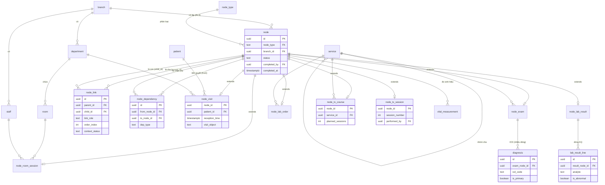
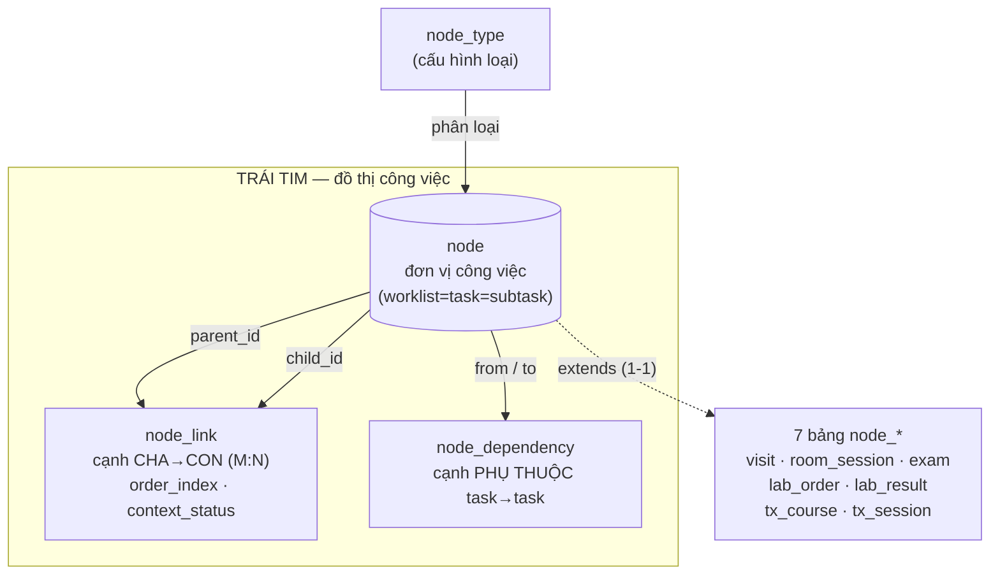
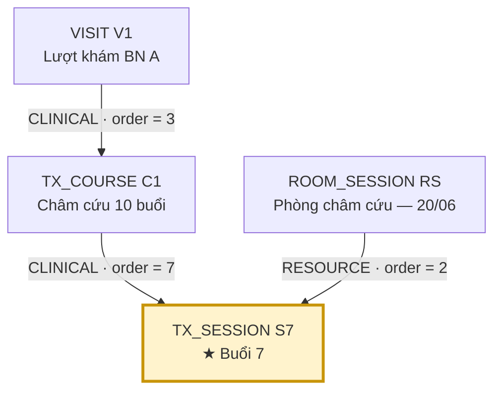
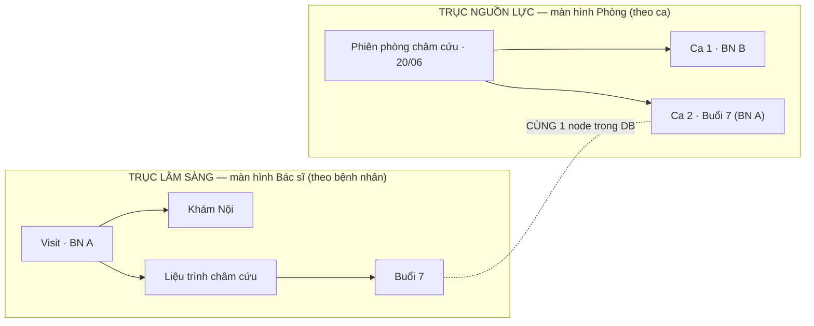

# Thiết kế DB — Đường B: Work-Graph (DAG + đệ quy)

> **Bối cảnh:** Đã chốt kiến trúc work-graph (xem [debate_summary.md](debate_summary.md)). Tài liệu này biến kết luận đó thành schema cụ thể: table gì, cột gì, lưu gì, và **chứng minh đạt 1NF/2NF/3NF**.
>
> **Storage strategy:** Class-Table Inheritance (CTI) — 1 bảng `node` gốc + mỗi loại node 1 bảng mở rộng. Chọn CTI thay vì JSONB vì dữ liệu y tế cần FK thật + ràng buộc kiểu + chuẩn hóa chặt.
>
> **Nền tảng giả định:** PostgreSQL / Supabase (như BLUEPRINT đã đề xuất).

---

## 1. Ba nhóm bảng

| Nhóm | Vai trò | Bảng |
|---|---|---|
| **A. Master / Domain** | Thực thể nền (ai, ở đâu, dịch vụ gì) | branch, department, room, staff, patient, service |
| **B. Work-Graph Core** | **Trái tim Đường B** — đồ thị công việc | node, node_link, node_dependency, node_type |
| **C. Extension (CTI)** | Thuộc tính riêng theo loại node | node_visit, node_room_session, node_exam, node_lab_order, node_lab_result, node_tx_course, node_tx_session |
| **D. Bảng con nhiều dòng** | Chuẩn hóa 1NF (không nhồi list vào 1 ô) | diagnosis, lab_result_line, vital_measurement |

Quy tắc vàng của CTI: **`node_id` của bảng mở rộng vừa là PK vừa là FK** → quan hệ 1-1 với `node`, không đẻ khóa thừa.

---

## 1bis. Biểu đồ trực quan (đọc trước phần DDL)

> Mỗi biểu đồ có **ảnh PNG đã render sẵn** (hiện trong mọi trình xem, kể cả VSCode không cài extension) + **mã Mermaid** kèm theo để chỉnh sửa. Ảnh nằm trong thư mục [diagrams/](diagrams/); render lại bằng `npx @mermaid-js/mermaid-cli -i diagrams/0X.mmd -o diagrams/0X.png -b white -s 2`.

### ⊕ Biểu đồ 1 — ER Diagram toàn hệ thống




> Đọc nhanh: `node` ở trung tâm. Mọi bảng `node_*` **mở rộng 1-1** từ nó (CTI). `node_link` & `node_dependency` đều nối `node` về chính `node` (đồ thị tự tham chiếu). Domain (patient/room/service/staff) trỏ vào bảng extension, **không** trỏ thẳng vào `node`.

### ⊕ Biểu đồ 2 — Khái niệm: 3 bảng lõi tạo thành đồ thị




> Độ sâu **không** cố định: vì `node_link` nối `node`→`node`, một node con lại có thể làm cha của node khác → đệ quy bao nhiêu tầng tùy nghiệp vụ (khám thường 2 tầng, gói tổng quát 4 tầng).

### ⊕ Biểu đồ 3 — Case B3 (liệu trình 10 buổi) dạng đồ thị ★




> **Buổi 7 (S7) có HAI cạnh cha đi vào**, mỗi cạnh một `order_index` riêng: trong liệu trình là việc thứ 7, trong hàng đợi phòng là ca thứ 2. **Một bản ghi `node`, hai cha, hai thứ tự.** Cây 3 tầng không vẽ được hình này — đây chính là lý do chọn Đường B.

### ⊕ Biểu đồ 4 — Hai trục giao nhau (cùng dữ liệu, hai màn hình)




> Hai subgraph = hai câu query (mục 8) trên **cùng tập node**. "Buổi 7" xuất hiện ở cả hai màn hình — đường nét đứt nhấn mạnh chúng là **một bản ghi duy nhất**, không phải hai bản sao cần đồng bộ.

---

## 2. Nhóm A — Master / Domain

```sql
CREATE TABLE branch (                       -- Chi nhánh / Cơ sở
  id          uuid PRIMARY KEY DEFAULT gen_random_uuid(),
  code        text UNIQUE NOT NULL,
  name        text NOT NULL,
  created_at  timestamptz NOT NULL DEFAULT now()
);

CREATE TABLE department (                   -- Khoa = đơn vị tổ chức (KHÔNG phải phòng)
  id          uuid PRIMARY KEY DEFAULT gen_random_uuid(),
  branch_id   uuid NOT NULL REFERENCES branch(id),
  code        text NOT NULL,
  name        text NOT NULL,
  UNIQUE (branch_id, code)
);

CREATE TABLE room (                         -- Phòng (thuộc khoa; tạo bằng tool, KHÔNG hardcode tên)
  id            uuid PRIMARY KEY DEFAULT gen_random_uuid(),
  department_id uuid NOT NULL REFERENCES department(id),
  code          text NOT NULL,
  name          text NOT NULL,
  function      text,                       -- chức năng: khám / siêu âm / xét nghiệm / châm cứu...
  UNIQUE (department_id, code)
);

CREATE TABLE staff (                        -- Nhân viên (bác sĩ, KTV, điều dưỡng, lễ tân...)
  id          uuid PRIMARY KEY DEFAULT gen_random_uuid(),
  branch_id   uuid NOT NULL REFERENCES branch(id),
  full_name   text NOT NULL,
  role        text NOT NULL,                -- DOCTOR|NURSE|LAB_TECH|IMAGING_TECH|RECEPTIONIST|CASHIER|ADMIN
  is_active   boolean NOT NULL DEFAULT true
);

CREATE TABLE patient (                      -- Bệnh nhân — MPI TOÀN CỤC (không gắn branch_id)
  id            uuid PRIMARY KEY DEFAULT gen_random_uuid(),
  patient_code  text UNIQUE NOT NULL,        -- 260001xxx
  full_name     text NOT NULL,
  birth_date    date,
  gender        text,
  phone         text,
  national_id   text
);

CREATE TABLE service (                      -- Danh mục dịch vụ (cây phân cấp Nhóm → Dịch vụ)
  id          uuid PRIMARY KEY DEFAULT gen_random_uuid(),
  parent_id   uuid REFERENCES service(id),   -- nhóm cha
  code        text UNIQUE NOT NULL,
  name        text NOT NULL,
  price_bh    numeric(14,2),                 -- giá bảo hiểm
  price_vp    numeric(14,2),                 -- giá viện phí (self-pay)
  is_group    boolean NOT NULL DEFAULT false
);
```

> **Quyết định MPI:** `patient` **không** có `branch_id` (bệnh nhân toàn cục, dùng chung mọi chi nhánh). Cô lập chi nhánh thực thi ở tầng `node.branch_id`, không ở tầng bệnh nhân — đúng kết luận BLOCKER #2 trong BLUEPRINT.

---

## 3. Nhóm B — Work-Graph Core (trái tim Đường B)

```sql
CREATE TABLE node_type (                    -- Loại node (cấu hình, không hardcode trong code)
  code  text PRIMARY KEY,                   -- VISIT|ROOM_SESSION|EXAM|LAB_ORDER|LAB_RESULT|TX_COURSE|TX_SESSION...
  name  text NOT NULL,
  axis  text NOT NULL                       -- CLINICAL | RESOURCE | BOTH
);

CREATE TABLE node (                         -- ĐƠN VỊ CÔNG VIỆC PHỔ QUÁT
  id           uuid PRIMARY KEY DEFAULT gen_random_uuid(),
  node_type    text NOT NULL REFERENCES node_type(code),
  branch_id    uuid NOT NULL REFERENCES branch(id),   -- cô lập đa chi nhánh (RLS gắn ở đây)
  title        text,
  status       text NOT NULL DEFAULT 'PENDING',
               -- DRAFT|PENDING|IN_PROGRESS|BLOCKED|COMPLETED|CANCELLED
  created_by   uuid REFERENCES staff(id),
  created_at   timestamptz NOT NULL DEFAULT now(),
  updated_at   timestamptz NOT NULL DEFAULT now(),
  completed_by uuid REFERENCES staff(id),    -- cơ chế khóa cứng (EzMon "Hoàn tất")
  completed_at timestamptz
);

CREATE TABLE node_link (                    -- CẠNH CHA→CON (M:N). ĐÂY là cái biến cây thành graph.
  id             uuid PRIMARY KEY DEFAULT gen_random_uuid(),
  parent_id      uuid NOT NULL REFERENCES node(id) ON DELETE CASCADE,
  child_id       uuid NOT NULL REFERENCES node(id) ON DELETE CASCADE,
  link_role      text NOT NULL,             -- CLINICAL (dưới Visit) | RESOURCE (dưới Phiên-phòng)
  order_index    int  NOT NULL DEFAULT 0,   -- ★ THỨ TỰ NẰM TRÊN CẠNH (mỗi cha có thứ tự riêng)
  context_status text,                      -- NULL = kế thừa node.status; có giá trị = trạng thái riêng theo góc nhìn
  created_at     timestamptz NOT NULL DEFAULT now(),
  UNIQUE (parent_id, child_id, link_role),
  CHECK  (parent_id <> child_id)
);

CREATE TABLE node_dependency (              -- CẠNH PHỤ THUỘC task→task (precondition). Tách khỏi cạnh cấu trúc.
  id           uuid PRIMARY KEY DEFAULT gen_random_uuid(),
  from_node_id uuid NOT NULL REFERENCES node(id) ON DELETE CASCADE,  -- điều kiện tiên quyết
  to_node_id   uuid NOT NULL REFERENCES node(id) ON DELETE CASCADE,  -- task bị chặn
  dep_type     text NOT NULL DEFAULT 'FINISH_TO_START',
  created_at   timestamptz NOT NULL DEFAULT now(),
  UNIQUE (from_node_id, to_node_id),
  CHECK  (from_node_id <> to_node_id)
);
```

### Ba điểm thiết kế quan trọng (đây là nơi Đường B khác hẳn cây)

1. **`order_index` nằm trên `node_link`, KHÔNG nằm trên `node`.** Vì một task có nhiều cha, mỗi cha xếp thứ tự riêng. Trong Visit-A, buổi châm là "việc thứ 7"; trong Phiên-phòng ngày đó, cùng buổi đó xếp theo giờ đến. Một con số `order` trên node không thể gánh cả hai. *(Đây cũng là điểm 2NF mấu chốt — xem mục 6.)*

2. **`context_status` trên cạnh** giải case A2 ("tạm rời phòng"): mặc định NULL → buổi khám kế thừa `node.status`. Khi góc nhìn phòng cần trạng thái khác góc nhìn lâm sàng, ghi đè ở cạnh — không đụng `node`.

3. **`node_dependency` tách hẳn `node_link`.** Cạnh cấu trúc (cha-con) và cạnh phụ thuộc (XN trước → kê đơn sau) là **hai loại đồ thị khác nhau**. Trộn chung sẽ sinh chu trình giả. Chặn chu trình (giữ tính DAG) làm bằng trigger/app-layer khi insert.

---

## 4. Nhóm C — Extension tables (CTI)

```sql
-- VISIT — worklist trục LÂM SÀNG (gốc theo bệnh nhân)
CREATE TABLE node_visit (
  node_id        uuid PRIMARY KEY REFERENCES node(id) ON DELETE CASCADE,
  patient_id     uuid NOT NULL REFERENCES patient(id),   -- ★ BỆNH NHÂN chỉ khai báo Ở ĐÂY
  department_id  uuid REFERENCES department(id),
  reception_time timestamptz NOT NULL,
  visit_object   text,                                   -- Đối tượng: KHONG_BH | BHYT...
  source         text
);

-- ROOM_SESSION — worklist trục NGUỒN LỰC (gốc theo phòng/ca)
CREATE TABLE node_room_session (
  node_id      uuid PRIMARY KEY REFERENCES node(id) ON DELETE CASCADE,
  room_id      uuid NOT NULL REFERENCES room(id),
  staff_id     uuid REFERENCES staff(id),                -- người phụ trách ca
  session_date date NOT NULL,
  shift        text
);

-- EXAM — task khám (con của Visit)
CREATE TABLE node_exam (
  node_id    uuid PRIMARY KEY REFERENCES node(id) ON DELETE CASCADE,
  service_id uuid REFERENCES service(id),                -- "khám nội" là một dịch vụ
  reason     text,        -- lý do đến khám
  history    text,        -- bệnh sử
  treatment  text         -- xử trí   (các trường text đều atomic → 1NF OK)
);

-- LAB_ORDER — task chỉ định xét nghiệm
CREATE TABLE node_lab_order (
  node_id        uuid PRIMARY KEY REFERENCES node(id) ON DELETE CASCADE,
  service_id     uuid NOT NULL REFERENCES service(id),
  room_id        uuid REFERENCES room(id),               -- phòng thực hiện
  sample_time    timestamptz,
  sample_quality text
);

-- LAB_RESULT — task nhập kết quả
CREATE TABLE node_lab_result (
  node_id      uuid PRIMARY KEY REFERENCES node(id) ON DELETE CASCADE,
  performed_by uuid REFERENCES staff(id),
  approved_by  uuid REFERENCES staff(id),
  approved_at  timestamptz
);

-- TREATMENT_COURSE — LIỆU TRÌNH (case B3)
CREATE TABLE node_tx_course (
  node_id          uuid PRIMARY KEY REFERENCES node(id) ON DELETE CASCADE,
  service_id       uuid NOT NULL REFERENCES service(id),
  planned_sessions int NOT NULL,            -- ví dụ 10
  date_from        date,
  date_to          date
);

-- TREATMENT_SESSION — BUỔI điều trị (2 cha: course + room_session)
CREATE TABLE node_tx_session (
  node_id        uuid PRIMARY KEY REFERENCES node(id) ON DELETE CASCADE,
  session_number int NOT NULL,              -- 1..10
  performed_by   uuid REFERENCES staff(id),
  performed_at   timestamptz
);
```

---

## 5. Nhóm D — Bảng con nhiều dòng (chuẩn hóa 1NF)

```sql
-- Chẩn đoán ICD của một EXAM (nhiều dòng, mã kép ICD-10 + ICD-YHCT)
CREATE TABLE diagnosis (
  id            uuid PRIMARY KEY DEFAULT gen_random_uuid(),
  exam_node_id  uuid NOT NULL REFERENCES node_exam(node_id) ON DELETE CASCADE,
  icd_code      text NOT NULL,
  icd_yhct_code text,
  is_primary    boolean NOT NULL DEFAULT false
);
-- Ràng buộc "đúng 1 ICD chính / phiếu" bằng partial unique index:
CREATE UNIQUE INDEX one_primary_icd ON diagnosis (exam_node_id) WHERE is_primary;

-- Dòng kết quả XN (nhiều dòng)
CREATE TABLE lab_result_line (
  id             uuid PRIMARY KEY DEFAULT gen_random_uuid(),
  result_node_id uuid NOT NULL REFERENCES node_lab_result(node_id) ON DELETE CASCADE,
  analyte        text NOT NULL,
  value          text,
  unit           text,
  ref_low        numeric,
  ref_high       numeric,
  is_abnormal    boolean
);

-- Lần đo sinh hiệu (gắn với 1 node bất kỳ: visit hoặc buổi điều trị)
CREATE TABLE vital_measurement (
  id          uuid PRIMARY KEY DEFAULT gen_random_uuid(),
  node_id     uuid NOT NULL REFERENCES node(id) ON DELETE CASCADE,
  measured_at timestamptz NOT NULL DEFAULT now(),
  weight_kg   numeric(5,2),
  height_cm   numeric(5,2),
  temp_c      numeric(4,1),
  pulse       int,
  spo2        int,
  bp_sys      int,
  bp_dia      int
  -- ★ BMI KHÔNG lưu — tính lúc đọc (tránh dữ liệu cũ; chỉ lưu số đo gốc)
);
```

> **Vì sao tách bảng con thay vì nhồi vào 1 ô?** Nếu lưu ICD dạng `"J00, R51"` trong một cột text → **vi phạm 1NF** (giá trị không nguyên tử), không query/ràng buộc "đúng 1 ICD chính" được. Tách dòng → mỗi giá trị một row → 1NF + đặt được unique index.

---

## 6. ★ Đi qua case B3 (liệu trình 10 buổi) bằng DỮ LIỆU THẬT

Đây là phép thử quyết định. Bệnh nhân A, châm cứu 10 buổi, đến 10 ngày khác nhau.

**`node`** (rút gọn):

| id | node_type | title | status |
|---|---|---|---|
| V1 | VISIT | Lượt khám BN A | IN_PROGRESS |
| C1 | TX_COURSE | Châm cứu 10 buổi | IN_PROGRESS |
| S7 | TX_SESSION | Buổi 7 | COMPLETED |
| RS | ROOM_SESSION | Phòng châm cứu — 20/06 | IN_PROGRESS |

**`node_link`** — chú ý buổi S7 có **2 cha**, mỗi cha **thứ tự riêng**:

| parent_id | child_id | link_role | order_index | ý nghĩa |
|---|---|---|---|---|
| V1 | C1 | CLINICAL | 3 | Liệu trình là việc thứ 3 trong lượt khám của A |
| C1 | S7 | CLINICAL | 7 | Buổi 7 là việc thứ **7** trong liệu trình |
| **RS** | **S7** | **RESOURCE** | **2** | Cùng buổi đó là ca thứ **2** trong hàng đợi phòng ngày 20/06 |

→ **Một bản ghi S7 duy nhất, 2 cha, 2 thứ tự khác nhau.** Đây chính là "1 task 2 cha" chạy được — và là lý do `order_index` **bắt buộc** nằm trên cạnh chứ không trên node.

**`node_tx_session`** (thuộc tính riêng của buổi):

| node_id | session_number | performed_by | performed_at |
|---|---|---|---|
| S7 | 7 | KTV Lan | 20/06 09:15 |

**`vital_measurement`** gắn thẳng vào S7 → mỗi buổi có sinh hiệu riêng, đúng yêu cầu granula.

Cây 3 tầng không biểu diễn được bảng `node_link` ở trên. Work-graph thì tự nhiên.

---

## 7. Kiểm tra chuẩn hóa 1NF / 2NF / 3NF

### 1NF — mọi giá trị nguyên tử, không nhóm lặp
✅ Đạt. Không cột nào chứa list. Những thứ "nhiều giá trị" (ICD, dòng KQ, sinh hiệu, **danh sách con của một node**) đều là **bảng riêng, mỗi giá trị một dòng**. Đặc biệt: "danh sách task con" KHÔNG phải cột lặp trên `node` mà là các dòng trong `node_link`.

### 2NF — không phụ thuộc một phần vào khóa
✅ Đạt. Hầu hết bảng dùng khóa thay thế đơn (`uuid`) → 2NF thỏa hiển nhiên.
Điểm tinh tế nằm ở **`node_link`** (khóa nghiệp vụ ghép `parent_id + child_id + link_role`):
- `order_index` phụ thuộc **toàn bộ** bộ ba (cùng một con, dưới cha khác/role khác thì thứ tự khác) — **không** phụ thuộc riêng `child_id`.
- → Nếu đặt `order_index` lên `node` (chỉ phụ thuộc `child_id`) thì **đó mới là vi phạm 2NF**. Thiết kế này tránh đúng cái bẫy đó.

### 3NF — không phụ thuộc bắc cầu (non-key → non-key)
✅ Đạt. Các quyết định cố ý để giữ 3NF:
- **`patient_id` chỉ ở `node_visit`.** Không lặp xuống `node_exam` / `node_tx_session`. Bệnh nhân của một buổi khám được **suy ra** qua chuỗi cạnh CLINICAL lên tới Visit → không có redundancy `exam → visit → patient` lưu thừa (vốn sẽ gây update anomaly).
- **Giá dịch vụ không copy vào node.** `node_exam.service_id` chỉ trỏ FK; giá đọc từ `service`. Tránh `node → service → price` lưu thừa.
- **BMI, Tuổi thai không lưu** — tính lúc đọc từ số đo / LMP gốc.

> **Lưu ý đánh đổi (denormalization có kiểm soát):** Suy ra `patient_id` qua chuỗi cạnh tốn 1 lần đệ quy mỗi query. Nếu hồ sơ lớn và truy vấn "tất cả việc của BN A" quá chậm, có thể thêm cột `root_visit_id` **đã tính sẵn** trên node lâm sàng (denormalize có chủ đích) — nhưng đó là tối ưu *sau khi đo*, không làm sớm.

---

## 8. Map sang UI — cùng một dữ liệu, hai màn hình

Sức mạnh Đường B: hai góc nhìn của granula là **hai câu query trên cùng tập node**, không phải hai cây dữ liệu.

**Màn hình Bác sĩ (góc Visit):** "Cho tôi mọi việc trong lượt khám của BN A, theo thứ tự lâm sàng."
```sql
WITH RECURSIVE tree AS (
  SELECT n.*, l.order_index, 1 AS depth
  FROM node n JOIN node_link l ON l.child_id = n.id
  WHERE l.parent_id = :visit_id AND l.link_role = 'CLINICAL'
  UNION ALL
  SELECT n.*, l.order_index, t.depth + 1
  FROM tree t
  JOIN node_link l ON l.parent_id = t.id AND l.link_role = 'CLINICAL'
  JOIN node n ON n.id = l.child_id
)
SELECT * FROM tree ORDER BY depth, order_index;
```

**Màn hình Phòng (góc nguồn lực):** "Hàng đợi phòng châm cứu hôm nay, theo giờ."
```sql
SELECT n.*, l.order_index, COALESCE(l.context_status, n.status) AS view_status
FROM node n
JOIN node_link l ON l.child_id = n.id
WHERE l.parent_id = :room_session_id AND l.link_role = 'RESOURCE'
ORDER BY l.order_index;
```

Cùng buổi S7 xuất hiện ở **cả hai** màn hình, mỗi nơi đúng thứ tự của nó, trạng thái có thể khác nhau qua `context_status`. UI render bằng **một component đệ quy** đọc theo `depth` → tự nhiên hỗ trợ độ sâu tùy biến (2 tầng khám thường, 4 tầng gói tổng quát) mà không sửa code.

---

## 9. Tổng kết bảng

| # | Bảng | Nhóm | Vai trò 1 dòng |
|---|---|---|---|
| 1 | branch | A | một chi nhánh |
| 2 | department | A | một khoa |
| 3 | room | A | một phòng |
| 4 | staff | A | một nhân viên |
| 5 | patient | A | một bệnh nhân (toàn cục) |
| 6 | service | A | một dịch vụ / nhóm dịch vụ |
| 7 | node_type | B | một loại node (cấu hình) |
| 8 | **node** | B | một đơn vị công việc bất kỳ |
| 9 | **node_link** | B | một cạnh cha→con (M:N) |
| 10 | **node_dependency** | B | một cạnh phụ thuộc task→task |
| 11 | node_visit | C | phần riêng của một lượt khám |
| 12 | node_room_session | C | phần riêng của một phiên phòng |
| 13 | node_exam | C | phần riêng của một phiếu khám |
| 14 | node_lab_order | C | phần riêng của một chỉ định XN |
| 15 | node_lab_result | C | phần riêng của một KQ XN |
| 16 | node_tx_course | C | phần riêng của một liệu trình |
| 17 | node_tx_session | C | phần riêng của một buổi điều trị |
| 18 | diagnosis | D | một dòng chẩn đoán ICD |
| 19 | lab_result_line | D | một dòng kết quả XN |
| 20 | vital_measurement | D | một lần đo sinh hiệu |

**3 bảng in đậm là toàn bộ "phép màu" của Đường B.** Mọi nghiệp vụ mới = thêm 1 `node_type` + (nếu cần) 1 bảng extension. Không bao giờ phải sửa 3 bảng lõi.

---

## 10. Việc còn treo (cần chốt trước khi code)

- [ ] **Chống chu trình** cho `node_link` (cây cấu trúc) và `node_dependency` (DAG): trigger kiểm tra lúc INSERT, hay app-layer? → quyết định để giữ tính DAG.
- [ ] **`node_type` cố định hay cho admin tạo runtime?** (granula muốn "tool tạo phòng" linh hoạt — node_type có nên tương tự?)
- [ ] **Khóa đồng thời (case B6):** dùng optimistic (`updated_at` version) hay pessimistic (như EzMon "Hủy hoàn tất")? Ảnh hưởng cột trên `node`.
- [ ] **RLS theo `branch_id`** trên `node`: viết policy Supabase cụ thể.
- [ ] Mở rộng cho module chưa chạm: thanh toán, thuốc, kho (đều map được vào node nhưng cần extension riêng).
```
