# Thiết kế DB — Đường B: Work-Graph (DAG + đệ quy)

> **Bối cảnh:** Đã chốt kiến trúc work-graph (xem [debate_summary.md](debate_summary.md)). Tài liệu này biến kết luận đó thành schema cụ thể: table gì, cột gì, lưu gì, và **chứng minh đạt 1NF/2NF/3NF**.
>
> **Storage strategy:** Class-Table Inheritance (CTI) — 1 bảng `node` gốc + mỗi loại node 1 bảng mở rộng. Chọn CTI thay vì JSONB vì dữ liệu y tế cần FK thật + ràng buộc kiểu + chuẩn hóa chặt.
>
> **Nền tảng giả định:** PostgreSQL / Supabase (như BLUEPRINT đã đề xuất).
>
> **⚑ Bản v1.1 — sửa theo quyết định của anh Dũng (2026-06-14):** Quan hệ task-khách ↔ task-phòng **KHÔNG** dùng chung 1 node 2 cha nữa. Chuyển sang mô hình **facade**: worklist KHÁCH và worklist NỘI BỘ là **hai cây node tách biệt**, nối nhau qua bảng cầu `task_bridge`. Worklist khách chỉ phơi "mặt tiền" (vào phòng + nhận KQ); mọi chi tiết thực thi (subtask, bước nội bộ) giấu trong worklist nội bộ. Đổi lại: phải **sync** trạng thái/KQ qua cầu. Xem mục 3 (`task_bridge`) + mục 6.

---

## 1. Bốn nhóm bảng

| Nhóm | Vai trò | Bảng |
|---|---|---|
| **A. Master / Domain** | Thực thể nền (ai, ở đâu, dịch vụ gì) | branch, department, room, staff, patient, service |
| **B. Work-Graph Core** | **Trái tim Đường B** — đồ thị công việc + cầu facade | node, node_link, node_dependency, **task_bridge**, node_type |
| **C. Extension (CTI)** | Thuộc tính riêng theo loại node | node_visit, node_room_session, node_exam, node_lab_order, node_lab_result, node_tx_course, node_tx_session |
| **D. Bảng con nhiều dòng** | Chuẩn hóa 1NF (không nhồi list vào 1 ô) | diagnosis, lab_result_line, vital_measurement |

Quy tắc vàng của CTI: **`node_id` của bảng mở rộng vừa là PK vừa là FK** → quan hệ 1-1 với `node`, không đẻ khóa thừa.

**Hai thế giới (facade):** mỗi `node` thuộc về **một** trong hai phía qua cột `node.visibility`:
- `CUSTOMER` — worklist khách: nông, mờ, chỉ "vào phòng + nhận KQ".
- `INTERNAL` — worklist nội bộ: đồ thị thật, chứa subtask + phụ thuộc + liệu trình, **khách không thấy** (RLS chặn).

`task_bridge` là **ranh giới duy nhất** nối hai phía — nơi trạng thái/kết quả được đẩy từ nội bộ ra mặt tiền.

---

## 1bis. Biểu đồ trực quan (đọc trước phần DDL)

> Mỗi biểu đồ có **ảnh PNG đã render sẵn** (hiện trong mọi trình xem, kể cả VSCode không cài extension) + **mã Mermaid** kèm theo để chỉnh sửa. Ảnh nằm trong thư mục [diagrams/](diagrams/); render lại bằng `npx @mermaid-js/mermaid-cli -i diagrams/0X.mmd -o diagrams/0X.png -b white -s 2`.

### ⊕ Biểu đồ 1 — ER Diagram toàn hệ thống

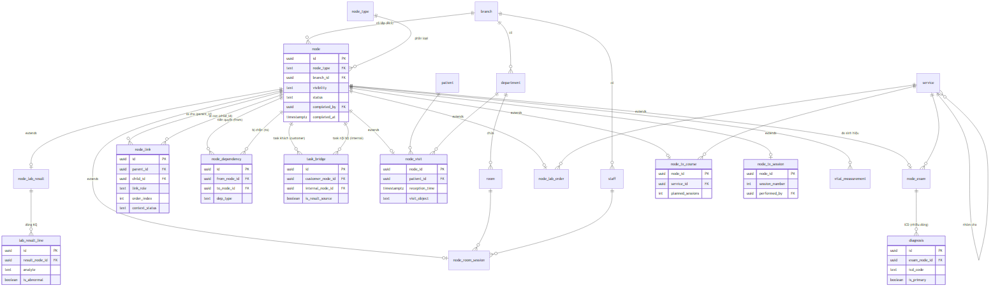

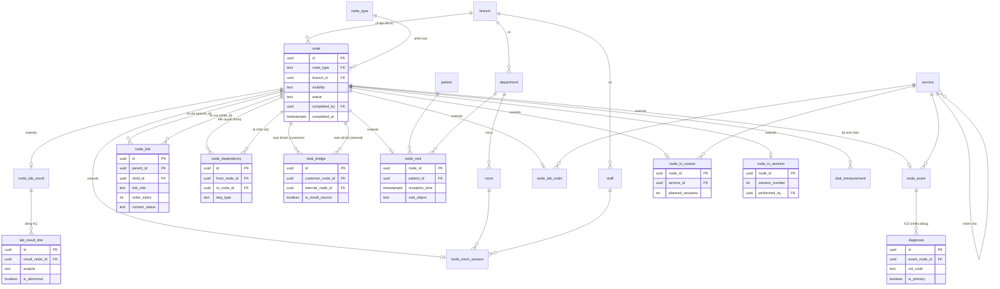

> Đọc nhanh: `node` ở trung tâm. Mọi bảng `node_*` **mở rộng 1-1** từ nó (CTI). `node_link` & `node_dependency` đều nối `node` về chính `node` (đồ thị tự tham chiếu). Domain (patient/room/service/staff) trỏ vào bảng extension, **không** trỏ thẳng vào `node`.
>
> 👉 Biểu đồ này lược cột cho gọn. **Bản ER ĐẦY ĐỦ mọi cột của cả 21 bảng + danh mục chức năng từng bảng: xem [Mục 11](#11-er-toàn-cảnh--danh-mục-bảng-chức-năng-từng-bảng).**

### ⊕ Biểu đồ 2 — Khái niệm: 4 bảng lõi tạo thành đồ thị + facade

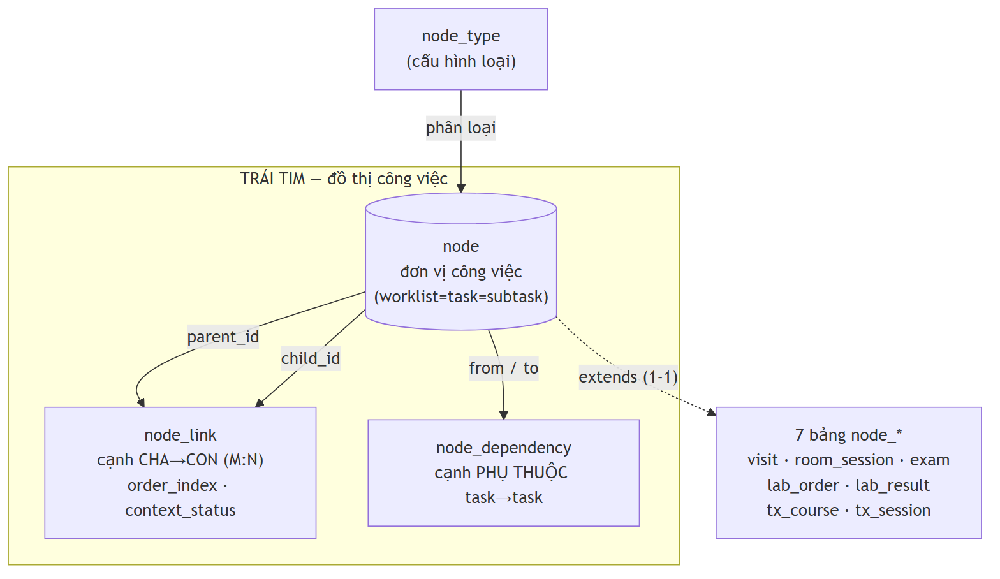

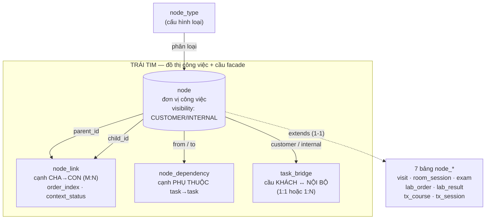

> Độ sâu **không** cố định: vì `node_link` nối `node`→`node`, một node con lại có thể làm cha của node khác → đệ quy bao nhiêu tầng tùy nghiệp vụ (khám thường 2 tầng, gói tổng quát 4 tầng). `task_bridge` nối hai phía facade mà không phá tính đệ quy của từng phía.

### ⊕ Biểu đồ 3 — Facade + bridge (case B3, liệu trình 10 buổi) ★

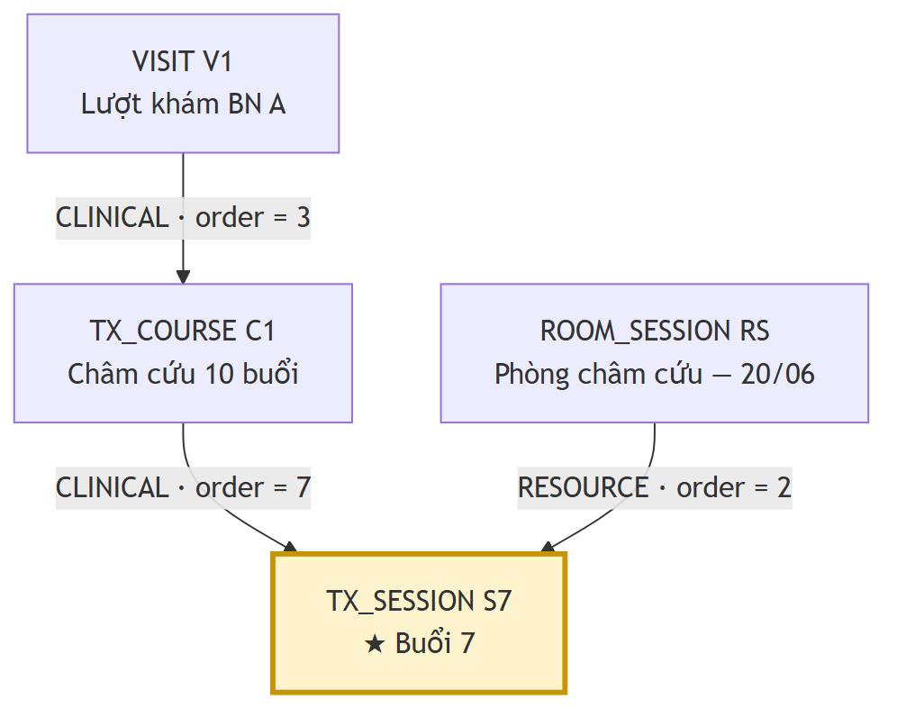

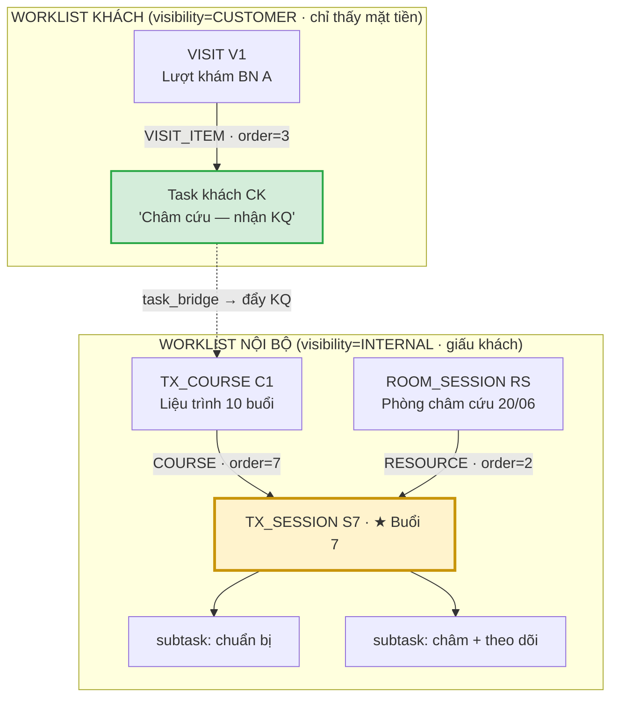

> Khách chỉ thấy **CK** (xanh). Toàn bộ đồ thị thật — liệu trình, buổi 7 với **2 cha** (`order=7` vs `order=2`), subtask — nằm trong vùng INTERNAL, **khách không chạm tới**. `task_bridge` là cây cầu duy nhất. Đa-cha vẫn còn (lý do `order` nằm trên cạnh) nhưng bị nhốt gọn phía nội bộ.

### ⊕ Biểu đồ 4 — Bridge 1:N (vì sao bridge phải là BẢNG)


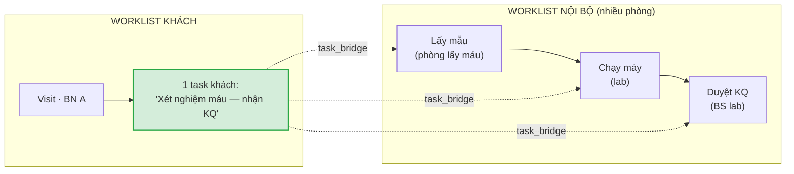

> **1 task khách → 3 task nội bộ.** Đây là case 1:N mà cột FK không làm được. Anh D chọn 1:1, nhưng dùng **bảng nối** `task_bridge` thì hôm sau gặp ca này chỉ cần thêm dòng — không đập schema. Đó là lý do câu hỏi (a) quan trọng.

---

## 2. Nhóm A — Master / Domain

```sql
CREATE TABLE branch (                       -- Chi nhánh / Cơ sở
  id          uuid PRIMARY KEY DEFAULT gen_random_uuid(),
  code        text UNIQUE NOT NULL,
  name        text NOT NULL,
  created_at  timestamptz NOT NULL DEFAULT now()
);

CREATE TABLE department (                   -- Khoa = đơn vị tổ chức (KHÔNG phải phòng)
  id          uuid PRIMARY KEY DEFAULT gen_random_uuid(),
  branch_id   uuid NOT NULL REFERENCES branch(id),
  code        text NOT NULL,
  name        text NOT NULL,
  UNIQUE (branch_id, code)
);

CREATE TABLE room (                         -- Phòng (thuộc khoa; tạo bằng tool, KHÔNG hardcode tên)
  id            uuid PRIMARY KEY DEFAULT gen_random_uuid(),
  department_id uuid NOT NULL REFERENCES department(id),
  code          text NOT NULL,
  name          text NOT NULL,
  function      text,                       -- chức năng: khám / siêu âm / xét nghiệm / châm cứu...
  UNIQUE (department_id, code)
);

CREATE TABLE staff (                        -- Nhân viên (bác sĩ, KTV, điều dưỡng, lễ tân...)
  id            uuid PRIMARY KEY DEFAULT gen_random_uuid(),
  branch_id     uuid NOT NULL REFERENCES branch(id),
  department_id uuid REFERENCES department(id),  -- khoa của nhân viên → dùng cho RLS lọc task theo khoa (xem mục 8B)
  full_name     text NOT NULL,
  role          text NOT NULL,              -- DOCTOR|NURSE|LAB_TECH|IMAGING_TECH|RECEPTIONIST|CASHIER|ADMIN
  is_active     boolean NOT NULL DEFAULT true
);

CREATE TABLE patient (                      -- Bệnh nhân — MPI TOÀN CỤC (không gắn branch_id)
  id            uuid PRIMARY KEY DEFAULT gen_random_uuid(),
  patient_code  text UNIQUE NOT NULL,        -- 260001xxx
  full_name     text NOT NULL,
  birth_date    date,
  gender        text,
  phone         text,
  national_id   text
);

CREATE TABLE service (                      -- Danh mục dịch vụ (cây phân cấp Nhóm → Dịch vụ)
  id          uuid PRIMARY KEY DEFAULT gen_random_uuid(),
  parent_id   uuid REFERENCES service(id),   -- nhóm cha
  code        text UNIQUE NOT NULL,
  name        text NOT NULL,
  price_bh    numeric(14,2),                 -- giá bảo hiểm
  price_vp    numeric(14,2),                 -- giá viện phí (self-pay)
  is_group    boolean NOT NULL DEFAULT false
);
```

> **Quyết định MPI:** `patient` **không** có `branch_id` (bệnh nhân toàn cục, dùng chung mọi chi nhánh). Cô lập chi nhánh thực thi ở tầng `node.branch_id`, không ở tầng bệnh nhân — đúng kết luận BLOCKER #2 trong BLUEPRINT.

---

## 3. Nhóm B — Work-Graph Core (trái tim Đường B)

```sql
CREATE TABLE node_type (                    -- Loại node (cấu hình, không hardcode trong code)
  code  text PRIMARY KEY,                   -- VISIT|ROOM_SESSION|EXAM|LAB_ORDER|LAB_RESULT|TX_COURSE|TX_SESSION...
  name  text NOT NULL,
  axis  text NOT NULL                       -- CLINICAL | RESOURCE | BOTH
);

CREATE TABLE node (                         -- ĐƠN VỊ CÔNG VIỆC PHỔ QUÁT
  id           uuid PRIMARY KEY DEFAULT gen_random_uuid(),
  node_type    text NOT NULL REFERENCES node_type(code),
  branch_id    uuid NOT NULL REFERENCES branch(id),   -- cô lập đa chi nhánh (RLS gắn ở đây)
  visibility   text NOT NULL DEFAULT 'INTERNAL',      -- ★ CUSTOMER (mặt tiền) | INTERNAL (giấu khách). RLS dựa vào đây.
  title        text,
  status       text NOT NULL DEFAULT 'PENDING',
               -- DRAFT|PENDING|IN_PROGRESS|BLOCKED|COMPLETED|CANCELLED
  created_by   uuid REFERENCES staff(id),
  created_at   timestamptz NOT NULL DEFAULT now(),
  updated_at   timestamptz NOT NULL DEFAULT now(),
  completed_by uuid REFERENCES staff(id),    -- cơ chế khóa cứng (EzMon "Hoàn tất")
  completed_at timestamptz
);

CREATE TABLE node_link (                    -- CẠNH CHA→CON (M:N) — xây cây/DAG BÊN TRONG một worklist.
  id             uuid PRIMARY KEY DEFAULT gen_random_uuid(),
  parent_id      uuid NOT NULL REFERENCES node(id) ON DELETE CASCADE,
  child_id       uuid NOT NULL REFERENCES node(id) ON DELETE CASCADE,
  link_role      text NOT NULL,             -- TRỤC gom (xem mục 8B): VISIT_ITEM (khách) | CLINICAL (lâm sàng, dưới visit) | RESOURCE (dưới phiên-phòng) | COURSE | SUBTASK
  order_index    int  NOT NULL DEFAULT 0,   -- ★ THỨ TỰ NẰM TRÊN CẠNH (mỗi cha có thứ tự riêng)
  context_status text,                      -- NULL = kế thừa node.status; ghi đè khi hai cha NỘI BỘ cần trạng thái khác nhau
  created_at     timestamptz NOT NULL DEFAULT now(),
  UNIQUE (parent_id, child_id, link_role),
  CHECK  (parent_id <> child_id)
);

CREATE TABLE node_dependency (              -- CẠNH PHỤ THUỘC task→task (precondition). Tách khỏi cạnh cấu trúc.
  id           uuid PRIMARY KEY DEFAULT gen_random_uuid(),
  from_node_id uuid NOT NULL REFERENCES node(id) ON DELETE CASCADE,  -- điều kiện tiên quyết
  to_node_id   uuid NOT NULL REFERENCES node(id) ON DELETE CASCADE,  -- task bị chặn
  dep_type     text NOT NULL DEFAULT 'FINISH_TO_START',
  created_at   timestamptz NOT NULL DEFAULT now(),
  UNIQUE (from_node_id, to_node_id),
  CHECK  (from_node_id <> to_node_id)
);

CREATE TABLE task_bridge (                  -- ★ CẦU FACADE: task KHÁCH ↔ task NỘI BỘ. Ranh giới che giấu thông tin.
  id               uuid PRIMARY KEY DEFAULT gen_random_uuid(),
  customer_node_id uuid NOT NULL REFERENCES node(id) ON DELETE CASCADE,  -- node visibility=CUSTOMER
  internal_node_id uuid NOT NULL REFERENCES node(id) ON DELETE CASCADE,  -- node visibility=INTERNAL
  is_result_source boolean NOT NULL DEFAULT false,  -- node nội bộ nào là nguồn KQ đẩy ra cho khách
  created_at       timestamptz NOT NULL DEFAULT now(),
  UNIQUE (customer_node_id, internal_node_id),
  CHECK  (customer_node_id <> internal_node_id)
);
-- BẢNG NỐI (không phải cột FK) → chịu được cả 1:1 LẪN 1:N.
-- 1:1 = "khám phòng Nội"; 1:N = "xét nghiệm máu" (1 task khách = lấy mẫu + chạy máy + duyệt KQ).
-- ⚠ (a) anh D nói 1:1 — dùng bảng nối để sau này gặp 1:N KHÔNG phải đập lại schema.
```

### Bốn điểm thiết kế quan trọng

1. **`order_index` nằm trên `node_link`, KHÔNG nằm trên `node`.** Một node nội bộ vẫn có nhiều cha (buổi châm thuộc cả phiên-phòng lẫn liệu trình), mỗi cha xếp thứ tự riêng: trong liệu trình là "buổi thứ 7", trong hàng đợi phòng là "ca thứ 2". Một con số `order` trên node không gánh nổi cả hai. *(Đây cũng là điểm 2NF mấu chốt — xem mục 7.)*

2. **`task_bridge` là ranh giới facade — và nó là một BẢNG, không phải cột FK.** Vì quan hệ khách↔nội-bộ có thể 1:N (1 task "xét nghiệm máu" của khách = nhiều task phòng). Cột FK chỉ làm được 1:1; bảng nối làm được cả hai. Anh D chọn 1:1 — bảng nối tôn trọng lựa chọn đó mà không nhốt mình: hôm sau cần 1:N thì thêm dòng, không đập schema.

3. **`node_dependency` tách hẳn `node_link`.** Cạnh cấu trúc (cha-con) và cạnh phụ thuộc (XN trước → kê đơn sau) là **hai loại đồ thị khác nhau**. Trộn chung sẽ sinh chu trình giả. Chặn chu trình (giữ tính DAG) làm bằng trigger/app-layer khi insert.

4. **Che giấu thông tin bằng `node.visibility` + RLS.** Khách chỉ đọc được node `CUSTOMER`. Toàn bộ subtask, bước trung gian, "cheat hack" nằm ở node `INTERNAL` — RLS chặn cứng, khách không bao giờ thấy. Đây là cột thực thi đúng yêu cầu của anh D, không phải logic ở tầng app (dễ rò).

---

## 4. Nhóm C — Extension tables (CTI)

```sql
-- VISIT — worklist trục LÂM SÀNG (gốc theo bệnh nhân)
CREATE TABLE node_visit (
  node_id        uuid PRIMARY KEY REFERENCES node(id) ON DELETE CASCADE,
  patient_id     uuid NOT NULL REFERENCES patient(id),   -- ★ BỆNH NHÂN chỉ khai báo Ở ĐÂY
  department_id  uuid REFERENCES department(id),
  reception_time timestamptz NOT NULL,
  visit_object   text,                                   -- Đối tượng: KHONG_BH | BHYT...
  source         text
);

-- ROOM_SESSION — worklist trục NGUỒN LỰC (gốc theo phòng/ca)
CREATE TABLE node_room_session (
  node_id      uuid PRIMARY KEY REFERENCES node(id) ON DELETE CASCADE,
  room_id      uuid NOT NULL REFERENCES room(id),
  staff_id     uuid REFERENCES staff(id),                -- người phụ trách ca
  session_date date NOT NULL,
  shift        text
);

-- EXAM — task khám (con của Visit)
CREATE TABLE node_exam (
  node_id    uuid PRIMARY KEY REFERENCES node(id) ON DELETE CASCADE,
  service_id uuid REFERENCES service(id),                -- "khám nội" là một dịch vụ
  reason     text,        -- lý do đến khám
  history    text,        -- bệnh sử
  treatment  text         -- xử trí   (các trường text đều atomic → 1NF OK)
);

-- LAB_ORDER — task chỉ định xét nghiệm
CREATE TABLE node_lab_order (
  node_id        uuid PRIMARY KEY REFERENCES node(id) ON DELETE CASCADE,
  service_id     uuid NOT NULL REFERENCES service(id),
  room_id        uuid REFERENCES room(id),               -- phòng thực hiện
  sample_time    timestamptz,
  sample_quality text
);

-- LAB_RESULT — task nhập kết quả
CREATE TABLE node_lab_result (
  node_id      uuid PRIMARY KEY REFERENCES node(id) ON DELETE CASCADE,
  performed_by uuid REFERENCES staff(id),
  approved_by  uuid REFERENCES staff(id),
  approved_at  timestamptz
);

-- TREATMENT_COURSE — LIỆU TRÌNH (case B3)
CREATE TABLE node_tx_course (
  node_id          uuid PRIMARY KEY REFERENCES node(id) ON DELETE CASCADE,
  service_id       uuid NOT NULL REFERENCES service(id),
  planned_sessions int NOT NULL,            -- ví dụ 10
  date_from        date,
  date_to          date
);

-- TREATMENT_SESSION — BUỔI điều trị (2 cha: course + room_session)
CREATE TABLE node_tx_session (
  node_id        uuid PRIMARY KEY REFERENCES node(id) ON DELETE CASCADE,
  session_number int NOT NULL,              -- 1..10
  performed_by   uuid REFERENCES staff(id),
  performed_at   timestamptz
);
```

---

## 5. Nhóm D — Bảng con nhiều dòng (chuẩn hóa 1NF)

```sql
-- Chẩn đoán ICD của một EXAM (nhiều dòng, mã kép ICD-10 + ICD-YHCT)
CREATE TABLE diagnosis (
  id            uuid PRIMARY KEY DEFAULT gen_random_uuid(),
  exam_node_id  uuid NOT NULL REFERENCES node_exam(node_id) ON DELETE CASCADE,
  icd_code      text NOT NULL,
  icd_yhct_code text,
  is_primary    boolean NOT NULL DEFAULT false
);
-- Ràng buộc "đúng 1 ICD chính / phiếu" bằng partial unique index:
CREATE UNIQUE INDEX one_primary_icd ON diagnosis (exam_node_id) WHERE is_primary;

-- Dòng kết quả XN (nhiều dòng)
CREATE TABLE lab_result_line (
  id             uuid PRIMARY KEY DEFAULT gen_random_uuid(),
  result_node_id uuid NOT NULL REFERENCES node_lab_result(node_id) ON DELETE CASCADE,
  analyte        text NOT NULL,
  value          text,
  unit           text,
  ref_low        numeric,
  ref_high       numeric,
  is_abnormal    boolean
);

-- Lần đo sinh hiệu (gắn với 1 node bất kỳ: visit hoặc buổi điều trị)
CREATE TABLE vital_measurement (
  id          uuid PRIMARY KEY DEFAULT gen_random_uuid(),
  node_id     uuid NOT NULL REFERENCES node(id) ON DELETE CASCADE,
  measured_at timestamptz NOT NULL DEFAULT now(),
  weight_kg   numeric(5,2),
  height_cm   numeric(5,2),
  temp_c      numeric(4,1),
  pulse       int,
  spo2        int,
  bp_sys      int,
  bp_dia      int
  -- ★ BMI KHÔNG lưu — tính lúc đọc (tránh dữ liệu cũ; chỉ lưu số đo gốc)
);
```

> **Vì sao tách bảng con thay vì nhồi vào 1 ô?** Nếu lưu ICD dạng `"J00, R51"` trong một cột text → **vi phạm 1NF** (giá trị không nguyên tử), không query/ràng buộc "đúng 1 ICD chính" được. Tách dòng → mỗi giá trị một row → 1NF + đặt được unique index.

---

## 6. Mô phỏng luồng dữ liệu — Happy case end-to-end

> Đi theo MỘT lượt khám bình thường từ đầu tới cuối, cho thấy **từng bước ghi gì xuống bảng nào**. Đọc mục này trước rồi xuống mục 6B (case khó) sẽ dễ thấm.

**Nhân vật (master data có sẵn):** BN Trần Văn B (`P_B`) · Lễ tân Hoa · BS Minh (phòng khám TMH `R_ENT`) · KTV Lan (phòng lấy máu `R_DRAW` + lab `R_LAB`) · dịch vụ `SV_ENT` (khám TMH), `SV_CBC` (công thức máu).

**Quy ước:** node KHÁCH = `CK*`, node NỘI BỘ = `IN*`. **＋** = INSERT, **✎** = UPDATE.

> **Ký hiệu:** **＋** = INSERT (tạo dòng mới), **✎** = UPDATE (đổi giá trị). Mỗi dòng ghi rõ giá trị cụ thể. Các ID `RS_ENT/RS_DRAW/RS_LAB` = phiên-phòng (room_session) mở sẵn đầu ngày; staff `Tâm` = BS duyệt lab.

### Bước 1 — Bệnh nhân vào, lễ tân tiếp nhận (Hoa) · 08:30
BN B tới quầy xin khám TMH. Lễ tân tạo lượt khám + đẩy vào hàng đợi phòng TMH.
- `patient` ＋ **P_B** = {code: **260001617**, name: **Trần Văn B**, dob: 1985-03-12, gender: Nam} *(chỉ khi BN mới)*
- `node` ＋ **V1** = {type: **VISIT**, visibility: **CUSTOMER**, status: **IN_PROGRESS**, branch: BR1, created_by: Hoa}
- `node_visit` ＋ {node_id: V1, patient: P_B, dept: TMH, reception_time: **2026-06-15 08:30**, visit_object: **KHONG_BH**}
- `node` ＋ **CK1** = {type: EXAM, visibility: **CUSTOMER**, title: "Khám TMH", status: PENDING}  ← thẻ khách
- `node` ＋ **IN1** = {type: EXAM, visibility: **INTERNAL**, title: "Khám TMH – BN B", status: PENDING}  ← thẻ nội bộ
- `node_link` ＋ {V1→CK1, **VISIT_ITEM**, order 1} · {V1→IN1, **CLINICAL**, order 1} · {RS_ENT→IN1, **RESOURCE**, order 3}
- `task_bridge` ＋ {customer: CK1, internal: IN1, is_result_source: true}

→ App khách: *"Khám TMH — đang chờ"*. Hàng đợi phòng TMH: B đứng vị trí #3.

### Bước 2 — Gọi vào phòng + đo sinh hiệu (Minh / điều dưỡng) · 08:42
- `node` ✎ IN1.status → **IN_PROGRESS** · sync qua cầu → `node` ✎ CK1.status → IN_PROGRESS (khách: "đang khám")
- `vital_measurement` ＋ {node_id: V1, measured_at: 08:42, **weight 68kg · height 170cm · temp 37.0 · pulse 78 · BP 120/80 · SpO2 98**}

### Bước 3 — Bác sĩ khám & chẩn đoán (Minh)
- `node_exam` ＋ {node_id: IN1, service: **SV_ENT**, reason: **"đau họng, ù tai 3 ngày"**, history: "không sốt", treatment: "chờ KQ máu"}
- `diagnosis` ＋ {exam_node_id: IN1, icd_code: **J31** (viêm mũi họng mạn), is_primary: **true**}

### Bước 4 — Chỉ định xét nghiệm (Minh) — 1 chỉ định khách = 2 việc nội bộ (1:N)
- `node` ＋ **CK2** = {LAB_ORDER, **CUSTOMER**, "Xét nghiệm máu", PENDING}
- `node` ＋ **IN2** = {LAB_ORDER, INTERNAL, "Lấy mẫu máu", PENDING} · ＋ **IN3** = {LAB_RESULT, INTERNAL, "Chạy & duyệt CBC", PENDING}
- `node_lab_order` ＋ {node_id: IN2, service: **SV_CBC**, room: R_DRAW}
- `node_link` ＋ {V1→CK2, **VISIT_ITEM**, 2} · {V1→IN3, **CLINICAL**, 2} · {RS_DRAW→IN2, **RESOURCE**, 1} · {RS_LAB→IN3, **RESOURCE**, 1}
- `node_dependency` ＋ {from: IN2, to: IN3} (lấy mẫu xong mới chạy máy)
- `task_bridge` ＋ {CK2↔IN2} · {CK2↔IN3, is_result_source: true}  ← **1 khách → 2 nội bộ**
- sync: `node` ✎ CK1.status → **COMPLETED** (khám xong)

### Bước 5 — Thực hiện xét nghiệm (Lan) · 09:10 → 09:40
- `node` ✎ IN2.status → **COMPLETED** · `node_lab_order` ✎ {sample_time: 09:10, sample_quality: **Đạt**}
- dependency IN2→IN3 thoả → IN3 mở khoá · `node` ✎ IN3.status → IN_PROGRESS
- `node_lab_result` ＋ {node_id: IN3, performed_by: **Lan**, approved_by: **Tâm**, approved_at: 09:40}
- `lab_result_line` ＋ nhiều dòng (mỗi chỉ số 1 dòng — **1NF**):

  | analyte | value | unit | ref | is_abnormal |
  |---|---|---|---|---|
  | WBC | **11.2** | 10⁹/L | 4–10 | **CAO** |
  | RBC | 4.9 | 10¹²/L | 4.2–5.4 | - |
  | HGB | 145 | g/L | 130–170 | - |

- `node` ✎ IN3.status → **COMPLETED** · sync (nguồn KQ = IN3) → `node` ✎ CK2.status → **COMPLETED** (khách: "đã có kết quả")

### Bước 6 — Bác sĩ đọc kết quả (Minh) — chủ yếu ĐỌC, ít sinh data
- Query đi theo trục **CLINICAL** của V1 → trả về **IN1** (chẩn đoán J31) + **IN3** (WBC cao). BS thấy KQ lab **dù lab do phòng khác làm** (nhờ dòng `V1→IN3 CLINICAL`).
- (nếu chốt phiếu) `node_exam` ✎ IN1.treatment = "WBC tăng nhẹ — kê kháng sinh, hẹn tái khám" · `node` ✎ IN1.status → **COMPLETED**

### Bước 7 — Kê đơn (Minh)
- `node` ＋ **IN4** = {PRESCRIPTION, INTERNAL, "Kê đơn", PENDING} · ＋ **CK3** = {PRESCRIPTION, CUSTOMER, "Nhận đơn thuốc"}
- `node_link` ＋ {V1→CK3, VISIT_ITEM, 3} · {V1→IN4, **CLINICAL**, 3} · {RS_ENT→IN4, **RESOURCE**, 5}
- `node_dependency` ＋ {from: IN3, to: IN4} (có KQ mới kê) · `task_bridge` ＋ {CK3↔IN4}
- (＋ `node_prescription` — module Thuốc, pha sau) · `node` ✎ IN4 → COMPLETED · sync ✎ CK3 → COMPLETED

### Bước 8 — Hẹn tái khám + đóng lượt
- `node` ＋ **IN5** {FOLLOWUP, INTERNAL} · ＋ **CK4** {FOLLOWUP, CUSTOMER, "Lịch tái khám"} · `node_followup` ＋ {hẹn sau 14 ngày} *(pha sau)*
- `node_link` ＋ {V1→CK4, VISIT_ITEM, 4} · {V1→IN5, **CLINICAL**, 4} · {RS_ENT→IN5, **RESOURCE**, 6} · `task_bridge` ＋ {CK4↔IN5}
- Tất cả CK1..CK4 = COMPLETED → `node` ✎ **V1.status → COMPLETED**

### Recap — bước nào sinh data ở bảng nào
| Bước | Bảng được ghi (＋ tạo / ✎ đổi) |
|---|---|
| 1 Tiếp nhận | patient ＋ · node ＋×2 · node_visit ＋ · node_link ＋×3 · task_bridge ＋ |
| 2 Gọi vào + sinh hiệu | node ✎ · vital_measurement ＋ |
| 3 Khám | node_exam ＋ · diagnosis ＋ |
| 4 Chỉ định XN | node ＋×3 · node_lab_order ＋ · node_link ＋×4 · node_dependency ＋ · task_bridge ＋×2 |
| 5 Làm XN | node ✎ · node_lab_order ✎ · node_lab_result ＋ · lab_result_line ＋×N |
| 6 Đọc KQ | (ĐỌC qua query) · node_exam ✎ · node ✎ |
| 7 Kê đơn | node ＋×2 · node_link ＋×3 · node_dependency ＋ · task_bridge ＋ |
| 8 Hẹn + đóng | node ＋×2 · node_followup ＋ · node_link ＋×3 · task_bridge ＋ · node ✎ (V1) |

> **Quy luật chung:** mỗi "việc" mới → **1 thẻ `node`** (+ thẻ khách nếu khách cần thấy) → **nối dây** (`node_link` VISIT_ITEM/CLINICAL/RESOURCE · `task_bridge` · `node_dependency`) → **chi tiết** vào bảng đính kèm (`node_exam`, `node_lab_result`…) + bảng con (`diagnosis`, `lab_result_line`). **Làm việc = đổi `status`. Xem việc = query theo dây.**

### Ảnh chụp cuối — bảng `node`
| id | visibility | node_type | title | status |
|---|---|---|---|---|
| V1 | CUSTOMER | VISIT | Lượt khám BN Trần Văn B | COMPLETED |
| CK1 | CUSTOMER | EXAM | Khám TMH | COMPLETED |
| CK2 | CUSTOMER | LAB_ORDER | Xét nghiệm máu — nhận KQ | COMPLETED |
| CK3 | CUSTOMER | PRESCRIPTION | Nhận đơn thuốc | COMPLETED |
| CK4 | CUSTOMER | FOLLOWUP | Lịch tái khám | COMPLETED |
| IN1 | INTERNAL | EXAM | Khám TMH (BS Minh) | COMPLETED |
| IN2 | INTERNAL | LAB_ORDER | Lấy mẫu máu | COMPLETED |
| IN3 | INTERNAL | LAB_RESULT | Chạy & duyệt CBC | COMPLETED |
| IN4 | INTERNAL | PRESCRIPTION | Kê đơn | COMPLETED |
| IN5 | INTERNAL | FOLLOWUP | Hẹn tái khám | COMPLETED |

→ 5 dòng CUSTOMER là **tất cả** những gì khách thấy. 5 dòng INTERNAL + room session + subtask + dòng KQ chi tiết: khách **không** chạm tới.

### ⊕ Sơ đồ luồng (diagram 5)

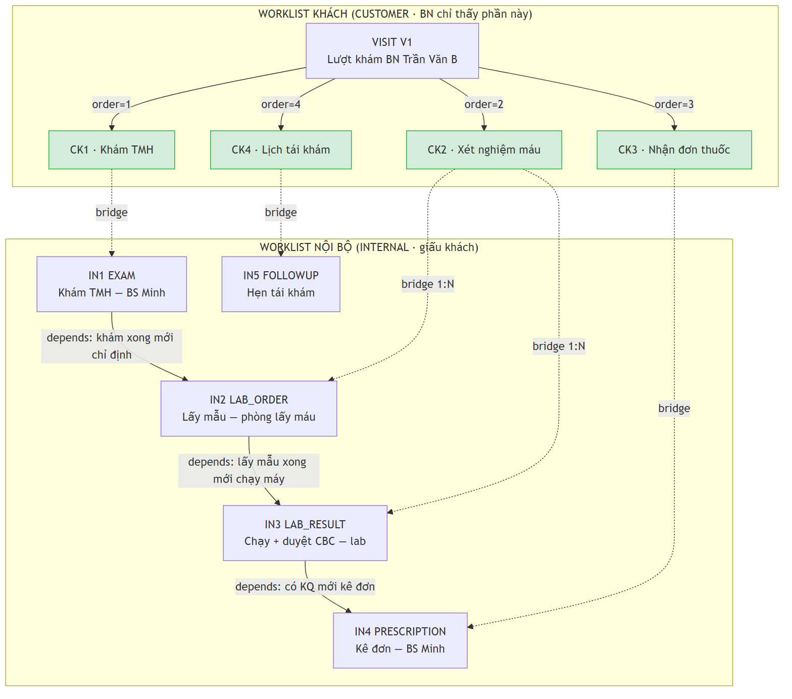

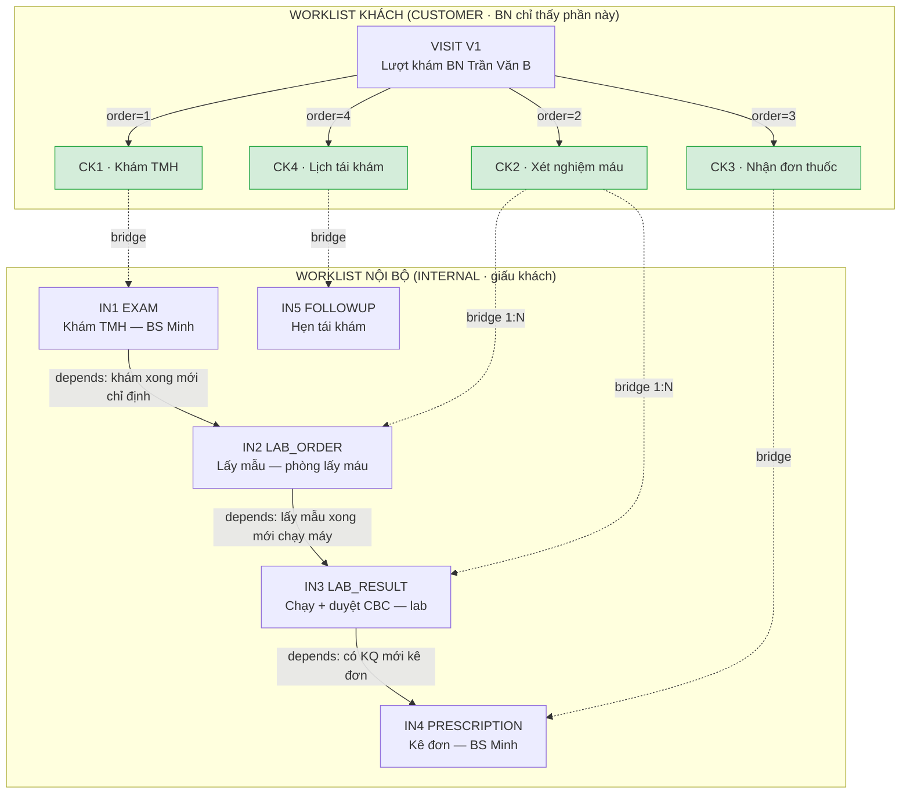

### ⊕ Sơ đồ 6 — Dữ liệu nằm ở bảng nào (kiểu ER có data)

Sơ đồ 5 cho thấy *luồng*; sơ đồ này cho thấy **mỗi dòng dữ liệu của happy case rơi vào bảng nào** — mỗi hộp là một bảng đã đổ data thật, mũi tên là khóa ngoại (FK).

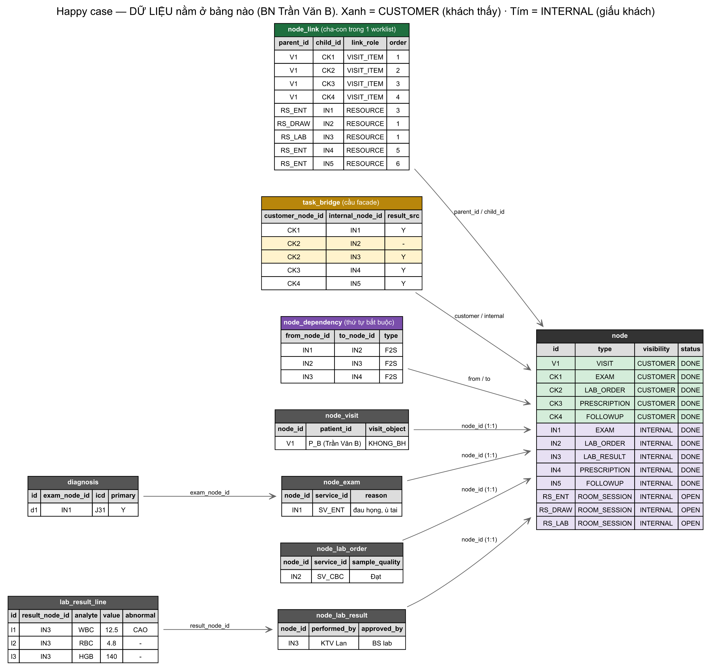

> Bản nét cao (zoom thoải mái): [diagrams/06_happy_data.svg](diagrams/06_happy_data.svg). Sửa data thì sửa [diagrams/06_happy_data.dot](diagrams/06_happy_data.dot) rồi render lại:
> `node diagrams/.build/render.mjs diagrams/06_happy_data.dot diagrams/06_happy_data.svg diagrams/06_happy_data.png`

**Đọc sơ đồ — 4 chỗ đáng nhìn:**

- **`node`** (phải) = hub. Xanh = `CUSTOMER` (khách thấy), tím = `INTERNAL` (giấu). Mọi bảng khác trỏ FK về nó.
- **`node_link`** (trên) chia **3 TRỤC theo màu** — đây là chìa khóa của "phân task theo khoa + xem kết quả chéo phòng" (mục 8B):
  - 🟩 `VISIT_ITEM` (xanh lá): `V1 → CK*` — app bệnh nhân (thẻ mỏng).
  - 🟦 `CLINICAL` (xanh dương): `V1 → IN1/IN3/IN4/IN5` — **hồ sơ BN cho bác sĩ, gom mọi phòng**.
  - 🟪 `RESOURCE` (tím): `phiên-phòng → IN*` — hàng đợi từng phòng.
  - → Nhìn kỹ: **`IN3` (kết quả XN) xuất hiện ở 2 dòng** — 1 dòng xanh dương (`V1→IN3 CLINICAL`, để BS nội đọc trong hồ sơ BN) + 1 dòng tím (`RS_LAB→IN3 RESOURCE`, để KTV lab làm). Đây là **một task treo trên hai dây** — bằng chứng data cho "hai trục".
- **`task_bridge`**: 2 dòng vàng `CK2→IN2` và `CK2→IN3` = **1 task khách / 2 task nội bộ (1:N)**.
- **`lab_result_line`**: 3 dòng WBC/RBC/HGB — mỗi chỉ số 1 dòng (1NF).

> **Vì sao BS nội thấy kết quả lab dù lab ở phòng khác?** Vì có dòng xanh dương `V1→IN3 CLINICAL`: kết quả treo về cùng lượt khám. Màn hình "hồ sơ BN" đi theo trục `CLINICAL` → gom được `IN3` dù nó do phòng Lab thực hiện. Còn màn hình "hàng đợi phòng nội" đi theo trục `RESOURCE` của phòng nội → không đụng `IN3`. Chi tiết + query: mục 8B.

### Luồng data: mỗi chuyên khoa thấy phần của mình thế nào?

"Đóng dấu thuộc phòng/khoa nào" cho mỗi task nằm ở **dòng `RESOURCE`** của `node_link` (task treo dưới phiên-phòng nào → thuộc phòng đó → `room → department` cho biết khoa). Đọc thẳng các dòng RESOURCE (màu tím) trong Sơ đồ 6:

- `RS_ENT → IN1, IN4, IN5` → thuộc **phòng khám nội**
- `RS_DRAW → IN2` → thuộc **phòng lấy máu**
- `RS_LAB → IN3` → thuộc **phòng xét nghiệm**

Mỗi màn hình chỉ lọc theo phiên-phòng (hoặc lượt khám) của mình → mỗi khoa nhận đúng phần data của khoa đó:

| Màn hình | Lọc dòng `node_link` nào | THẤY | KHÔNG thấy |
|---|---|---|---|
| Hàng đợi **phòng nội** | `RESOURCE`, parent = RS_ENT | IN1, IN4, IN5 | IN2, **IN3** |
| Hàng đợi **phòng XN** | `RESOURCE`, parent = RS_LAB | **IN3** | IN1, IN4, IN5 |
| **Hồ sơ BN** (BS nội mở lại) | `CLINICAL`, parent = V1 | IN1, **IN3**, IN4, IN5 | (chỉ ẩn thẻ khách CK*) |

**Mấu chốt — `IN3` đi 2 đường:** dòng `RESOURCE` đẩy nó vào hàng đợi **phòng XN** (để KTV làm); dòng `CLINICAL` đẩy nó vào **hồ sơ BN** (để BS nội đọc). Nên BS nội **không** thấy IN3 trong hàng đợi phòng mình, **nhưng** thấy IN3 khi mở hồ sơ BN. Một task, hai dây, hai màn hình:

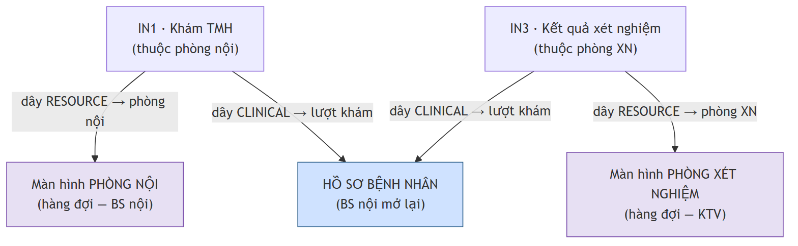

**Tổng quát cho N chuyên khoa:** mỗi khoa = một tập phiên-phòng. Màn hình phòng của khoa chỉ lọc phiên-phòng thuộc khoa đó (`room.department_id`). Thêm khoa Sản, Nhi, Da liễu... chỉ là thêm phiên-phòng mới — mỗi khoa **tự động** chỉ thấy task của mình, không cần code riêng cho từng khoa. Các khoa **không** thấy task của nhau trên "hàng đợi phòng"; chỉ gặp nhau ở "hồ sơ bệnh nhân" (trục `CLINICAL`) — đúng như mong muốn. Muốn cấm cả *quyền đọc* chéo khoa → RLS theo `staff.department_id` (mục 8B).

> **3 điều mục này chứng minh:**
> 1. **Che giấu:** khách chỉ thấy 5 dòng `CK*` mờ; toàn bộ `IN*`, room session, subtask, KQ chi tiết bị giấu (`visibility` + RLS).
> 2. **Bridge 1:N:** "Xét nghiệm máu" = CK2 → (IN2 + IN3). Đúng case (a) đang chờ anh D chốt — và vì cầu là bảng nối nên 1:N chạy được ngay.
> 3. **Thứ tự thật bằng `node_dependency`**, không phải bằng cấp bậc cây: lấy mẫu → chạy máy → có KQ → kê đơn là chuỗi mũi tên ngang, đúng cái mà "cây" không vẽ được (khó khăn #2).

---

## 6B. ★ Trường hợp khó — case B3 (liệu trình 10 buổi)

Bệnh nhân A, châm cứu 10 buổi, đến 10 ngày khác nhau. Mô hình facade: **mặt tiền cho khách + đồ thị thật giấu bên trong + cầu nối**.

**`node`** — chú ý cột `visibility` chia hai thế giới:

| id | node_type | visibility | title | status |
|---|---|---|---|---|
| V1 | VISIT | **CUSTOMER** | Lượt khám BN A | IN_PROGRESS |
| CK | TX_COURSE | **CUSTOMER** | "Châm cứu — theo dõi & nhận KQ" (mặt tiền) | IN_PROGRESS |
| C1 | TX_COURSE | **INTERNAL** | Liệu trình 10 buổi (thực thi) | IN_PROGRESS |
| S7 | TX_SESSION | **INTERNAL** | Buổi 7 | COMPLETED |
| RS | ROOM_SESSION | **INTERNAL** | Phòng châm cứu — 20/06 | IN_PROGRESS |

**`node_link`** — đa-cha **vẫn còn, nhưng nằm TRỌN trong phía INTERNAL**:

| parent_id | child_id | link_role | order_index | phía | ý nghĩa |
|---|---|---|---|---|---|
| V1 | CK | VISIT_ITEM | 3 | KHÁCH | Liệu trình là mục thứ 3 khách thấy trong lượt khám |
| C1 | S7 | COURSE | **7** | NỘI BỘ | Buổi 7 là bước thứ **7** trong liệu trình |
| RS | S7 | RESOURCE | **2** | NỘI BỘ | Cùng buổi đó là ca thứ **2** trong hàng đợi phòng 20/06 |

→ S7 vẫn **2 cha, 2 thứ tự** (đây là lý do `order_index` phải nằm trên cạnh — điểm 2NF). Khác bản cũ: hai cha này đều **INTERNAL**, khách không chạm tới.

**`task_bridge`** — cây cầu duy nhất bắc qua ranh giới:

| customer_node_id | internal_node_id | is_result_source |
|---|---|---|
| CK | C1 | true |

→ Khách nhìn **CK**; hệ thống đẩy tiến độ ("6/10 buổi") và KQ từ **C1** lên CK qua cầu. Khách **không thấy** S7, RS, hay bất kỳ subtask nào. Mấy "cheat hack" anh D nói sống an toàn ở phía INTERNAL.

**`node_tx_session`** + **`vital_measurement`** gắn thẳng vào S7 (INTERNAL) → mỗi buổi có người thực hiện + sinh hiệu riêng, vẫn ẩn với khách.

**A2 đã được anh D vá ở đây:** CK có trạng thái mờ riêng ("đang điều trị / có KQ"), C1+S7 có trạng thái chi tiết riêng — **hai record khác nhau**, không phải nhồi 2 trạng thái vào 1 node như bản cũ. `context_status` trên cạnh giờ chỉ còn là công cụ dự phòng cho phân kỳ trong nội bộ.

> **Còn treo (b):** "buổi hôm nay" có nên là task khách riêng (khách check-in mỗi ngày) hay không — quyết định worklist khách 2 tầng (V1→CK) hay 3 tầng. Đang chờ anh D chốt; schema chịu được cả hai (chỉ là thêm/bớt node CUSTOMER + dòng bridge).

---

## 7. Kiểm tra chuẩn hóa 1NF / 2NF / 3NF

### 1NF — mọi giá trị nguyên tử, không nhóm lặp
✅ Đạt. Không cột nào chứa list. Những thứ "nhiều giá trị" (ICD, dòng KQ, sinh hiệu, **danh sách con của một node**) đều là **bảng riêng, mỗi giá trị một dòng**. Đặc biệt: "danh sách task con" KHÔNG phải cột lặp trên `node` mà là các dòng trong `node_link`.

### 2NF — không phụ thuộc một phần vào khóa
✅ Đạt. Hầu hết bảng dùng khóa thay thế đơn (`uuid`) → 2NF thỏa hiển nhiên.
Điểm tinh tế nằm ở **`node_link`** (khóa nghiệp vụ ghép `parent_id + child_id + link_role`):
- `order_index` phụ thuộc **toàn bộ** bộ ba (cùng một con, dưới cha khác/role khác thì thứ tự khác) — **không** phụ thuộc riêng `child_id`.
- → Nếu đặt `order_index` lên `node` (chỉ phụ thuộc `child_id`) thì **đó mới là vi phạm 2NF**. Thiết kế này tránh đúng cái bẫy đó.

### 3NF — không phụ thuộc bắc cầu (non-key → non-key)
✅ Đạt. Các quyết định cố ý để giữ 3NF:
- **`patient_id` chỉ ở `node_visit`.** Không lặp xuống node nội bộ. Bệnh nhân của một task nội bộ được **suy ra** qua chuỗi: `internal_node → task_bridge → customer_node → node_link(VISIT_ITEM) → V1 → node_visit.patient_id`. Không lưu thừa → không update anomaly.
- **Giá dịch vụ không copy vào node.** `node_exam.service_id` chỉ trỏ FK; giá đọc từ `service`. Tránh `node → service → price` lưu thừa.
- **BMI, Tuổi thai không lưu** — tính lúc đọc từ số đo / LMP gốc.

> **Lưu ý đánh đổi (denormalization có kiểm soát):** Sau khi tách facade, đường suy ra `patient_id` cho node nội bộ dài tới **4 hop** (qua cầu). Lý thuyết thì 3NF-sạch, nhưng "hiện tên BN trên hàng đợi phòng" mà join 4 hop mỗi dòng thì xót. Cách thực dụng: denormalize `patient_id` (hoặc `root_visit_id`) **đã tính sẵn** lên node nội bộ lâm sàng. Đây là denormalize CÓ CHỦ ĐÍCH, ghi rõ, làm *sau khi đo* — không phải lỗi thiết kế.

---

## 8. Map sang UI — hai worklist, một cây cầu

Khác bản cũ: **không còn "cùng tập node"** — mà là HAI tập node tách biệt, nối qua `task_bridge`. Đúng tinh thần facade của anh D.

**① Màn hình KHÁCH (mặt tiền):** chỉ node `CUSTOMER`, nông, không lộ nội bộ.
```sql
SELECT n.*, l.order_index
FROM node n
JOIN node_link l ON l.child_id = n.id AND l.link_role = 'VISIT_ITEM'
WHERE l.parent_id = :visit_id AND n.visibility = 'CUSTOMER'
ORDER BY l.order_index;
```

**② Màn hình NỘI BỘ / phòng (thực thi):** recursive CTE đệ quy mọi tầng của worklist nội bộ.
```sql
WITH RECURSIVE tree AS (
  SELECT n.*, l.order_index, 1 AS depth
  FROM node n JOIN node_link l ON l.child_id = n.id
  WHERE l.parent_id = :root_id            -- room_session HOẶC course nội bộ
  UNION ALL
  SELECT n.*, l.order_index, t.depth + 1
  FROM tree t
  JOIN node_link l ON l.parent_id = t.id
  JOIN node n ON n.id = l.child_id
)
SELECT * FROM tree WHERE visibility = 'INTERNAL' ORDER BY depth, order_index;
```

**③ Đẩy KQ ra mặt tiền (qua cầu):** trạng thái khách = chiếu từ node nội bộ nguồn-KQ.
```sql
SELECT ck.id  AS customer_task,
       ck.status AS facade_status,      -- cái khách thấy (mờ)
       ci.status AS internal_status     -- cái khách KHÔNG thấy (chi tiết)
FROM task_bridge b
JOIN node ck ON ck.id = b.customer_node_id
JOIN node ci ON ci.id = b.internal_node_id AND b.is_result_source
WHERE ck.id = :customer_task_id;
```

**Sync** = một trigger/job đẩy `internal → customer` khi node nguồn-KQ chuyển `COMPLETED`. Đây chính là **cái giá** của facade (xem mục 3) — đổi lấy việc khách không bao giờ thấy ruột gan nội bộ. UI nội bộ render bằng **một component đệ quy** đọc theo `depth` → độ sâu tùy biến (khám thường 2 tầng, gói tổng quát 4 tầng) không sửa code.

---

## 8B. Định tuyến task theo khoa/phòng & xem kết quả chéo phòng

> Trả lời 3 câu thực tế: (1) task của mỗi khoa phân biệt thế nào, (2) sao BS nội chỉ thấy task phòng nội, (3) sao BS nội vẫn thấy kết quả lab dù lab ở phòng khác.

### Ý cốt: một task treo trên NHIỀU dây cha, mỗi `link_role` = một "trục"

Một task nội bộ không chỉ có 1 cha. Nó treo đồng thời trên nhiều dây `node_link`, mỗi dây mang một `link_role` khác nhau — và **mỗi màn hình đi theo một trục khác nhau**:

| `link_role` | Cha là | Phục vụ màn hình | Ai xem |
|---|---|---|---|
| `VISIT_ITEM` | visit | App bệnh nhân (thẻ mỏng) | Khách |
| `CLINICAL` | visit | **Hồ sơ / lượt khám của BN** (mọi phòng) | Bác sĩ |
| `RESOURCE` | room_session | **Hàng đợi phòng** (1 phòng) | KTV/BS phòng đó |
| `COURSE` / `SUBTASK` | task khác | Lồng tầng bên trong nội bộ | Nội bộ |

→ Cùng một task "kết quả XN" treo trên **cả** `RESOURCE` (dưới phiên-phòng-Lab, để lab làm) **lẫn** `CLINICAL` (dưới visit của BN, để BS đọc). Một task, hai trục, hai màn hình.

### Ba role khác nhau ở đâu (sơ đồ)

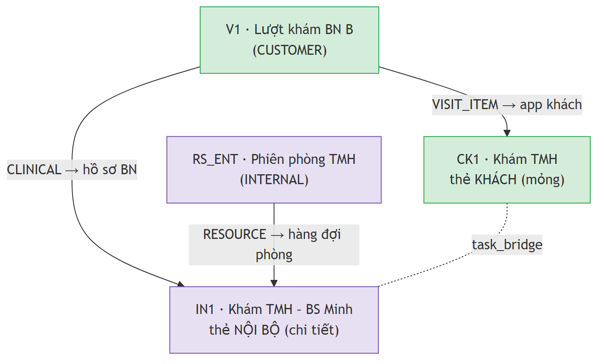

**Nhầm nhiều nhất: `VISIT_ITEM` vs `CLINICAL`** — cả hai cha đều là lượt khám `V1`, chỉ khác **con**, vì phục vụ hai người xem:
- `VISIT_ITEM → CK1`: con là **thẻ khách** (mỏng). Mặt tiền — bệnh nhân chỉ thấy "Khám TMH".
- `CLINICAL → IN1`: con là **thẻ nội bộ** (chi tiết). Hồ sơ thật — bác sĩ thấy phiếu khám + chẩn đoán.
- → Một lượt khám có **2 bộ con** (cho khách / cho bác sĩ), nối cặp với nhau bằng `task_bridge`.

**`RESOURCE` khác hẳn:** cha là **phòng** (`room_session`), không phải lượt khám → đây là hàng đợi của phòng, gom theo nguồn lực chứ không theo bệnh nhân.

4 dòng dữ liệu quanh task khám:
- `node_link {V1→CK1, VISIT_ITEM}` — khách thấy
- `node_link {V1→IN1, CLINICAL}` — bác sĩ thấy (hồ sơ BN)
- `node_link {RS_ENT→IN1, RESOURCE}` — phòng TMH thấy (hàng đợi)
- `task_bridge {CK1↔IN1}` — nối thẻ khách ↔ thẻ nội bộ
- → `IN1` có **2 dòng node_link** (CLINICAL + RESOURCE = treo 2 trục); `CK1` chỉ **1 dòng** (VISIT_ITEM) + 1 cầu.

**Vì sao gộp 3 nghĩa vào 1 bảng (không tách 3 bảng riêng)?** Cả ba cùng cấu trúc `(parent_id, child_id, order_index)` — chỉ khác *ý nghĩa*. Một bảng + cột `link_role` → một logic đệ quy chạy cho cả ba (chỉ đổi điều kiện `link_role`); mai cần trục thứ 4 (vd `BILLING` gom theo hóa đơn) = thêm 1 giá trị role, **không đụng schema**.

### (1) Task thuộc khoa nào?
Suy ra từ dây `RESOURCE`: `task → room_session → room → department`. Không lưu thừa `department_id` trên task — derive khi cần (hoặc denormalize nếu query nóng).

### (2) BS nội chỉ thấy task phòng nội — query hàng đợi phòng
```sql
-- :room_session_id = phiên làm việc của PHÒNG NỘI hôm nay
SELECT n.*, l.order_index
FROM node n
JOIN node_link l ON l.child_id = n.id AND l.link_role = 'RESOURCE'
WHERE l.parent_id = :room_session_id
ORDER BY l.order_index;
```
Task xét nghiệm treo dưới phiên-phòng-**Lab** → không khớp `:room_session_id` của phòng nội → **không xuất hiện**. Lọc theo cấu trúc, không cần lọc tay.

### (3) BS nội thấy kết quả lab — query hồ sơ bệnh nhân
```sql
-- :visit_id = lượt khám của BN. Đi theo trục CLINICAL, đệ quy mọi tầng.
WITH RECURSIVE clinical AS (
  SELECT n.*, l.order_index, 1 AS depth
  FROM node n
  JOIN node_link l ON l.child_id = n.id AND l.link_role = 'CLINICAL'
  WHERE l.parent_id = :visit_id
  UNION ALL
  SELECT n.*, l.order_index, c.depth + 1
  FROM clinical c
  JOIN node_link l ON l.parent_id = c.id
  JOIN node n ON n.id = l.child_id
)
SELECT * FROM clinical WHERE node_type IN ('LAB_RESULT','EXAM','PRESCRIPTION', ...) ORDER BY depth, order_index;
-- → ra cả kết quả lab (do phòng Lab làm) vì nó treo CLINICAL dưới cùng visit.
```
BS nội thấy kết quả **không phải** qua hàng đợi phòng (task lab đâu có ở đó) mà qua **hồ sơ BN** — màn hình đi theo trục `CLINICAL`, gom mọi phòng về một lượt khám.

### Khóa quyền cứng (tùy chọn): RLS theo khoa
Lọc theo query (mục 2 trên) là đủ để *ẩn* trên UI. Muốn cấm *quyền đọc*:
```sql
-- nhân viên chỉ đọc task mà phòng thực hiện thuộc khoa mình
-- (dùng staff.department_id ↔ room.department_id qua room_session)
CREATE POLICY task_by_dept ON node FOR SELECT USING ( ... khoa của task = khoa của current_staff ... );
```
> Lưu ý: hồ sơ BN (trục CLINICAL) cần policy nới hơn — BS điều trị được đọc kết quả mọi phòng của BN mình phụ trách. Tách 2 chế độ: *"việc phòng tôi"* (khóa theo khoa) vs *"hồ sơ BN tôi"* (theo BN, không khóa khoa).

### Bổ sung cho happy case (Mục 6)
Để hồ sơ BN chạy đúng, thêm các dây `CLINICAL` từ visit tới các mốc lâm sàng (ngoài dây `RESOURCE` đã có):
`node_link(V1→IN1, CLINICAL)` · `node_link(V1→IN3, CLINICAL)` · `node_link(V1→IN4, CLINICAL)` · `node_link(V1→IN5, CLINICAL)`.
→ Nhờ vậy mở visit V1 là thấy khám + **kết quả lab** + đơn + hẹn, dù IN3 do phòng Lab làm.

**Chốt:** *"Việc của phòng tôi"* đi theo trục `RESOURCE` (chỉ phòng mình). *"Hồ sơ bệnh nhân"* đi theo trục `CLINICAL` (mọi phòng). Một task nằm trên cả hai trục → vừa vào hàng đợi phòng lab, vừa hiện trong hồ sơ cho BS nội. Đây là **"hai trục"** từ buổi debate đầu, nay thành `link_role`.

---

## 9. Tổng kết bảng

| # | Bảng | Nhóm | Vai trò 1 dòng |
|---|---|---|---|
| 1 | branch | A | một chi nhánh |
| 2 | department | A | một khoa |
| 3 | room | A | một phòng |
| 4 | staff | A | một nhân viên |
| 5 | patient | A | một bệnh nhân (toàn cục) |
| 6 | service | A | một dịch vụ / nhóm dịch vụ |
| 7 | node_type | B | một loại node (cấu hình) |
| 8 | **node** | B | một đơn vị công việc bất kỳ |
| 9 | **node_link** | B | một cạnh cha→con (M:N) trong 1 worklist |
| 10 | **node_dependency** | B | một cạnh phụ thuộc task→task |
| 11 | **task_bridge** | B | một mối nối task khách ↔ task nội bộ (facade) |
| 12 | node_visit | C | phần riêng của một lượt khám |
| 13 | node_room_session | C | phần riêng của một phiên phòng |
| 14 | node_exam | C | phần riêng của một phiếu khám |
| 15 | node_lab_order | C | phần riêng của một chỉ định XN |
| 16 | node_lab_result | C | phần riêng của một KQ XN |
| 17 | node_tx_course | C | phần riêng của một liệu trình |
| 18 | node_tx_session | C | phần riêng của một buổi điều trị |
| 19 | diagnosis | D | một dòng chẩn đoán ICD |
| 20 | lab_result_line | D | một dòng kết quả XN |
| 21 | vital_measurement | D | một lần đo sinh hiệu |

**4 bảng in đậm là toàn bộ "phép màu" của Đường B + facade.** Mọi nghiệp vụ mới = thêm 1 `node_type` + (nếu cần) 1 bảng extension. Không bao giờ phải sửa 4 bảng lõi.

---

## 10. Việc còn treo (cần chốt trước khi code)

- [ ] **Chống chu trình** cho `node_link` (cây cấu trúc) và `node_dependency` (DAG): trigger kiểm tra lúc INSERT, hay app-layer? → quyết định để giữ tính DAG.
- [ ] **`node_type` cố định hay cho admin tạo runtime?** (granula muốn "tool tạo phòng" linh hoạt — node_type có nên tương tự?)
- [ ] **Khóa đồng thời (case B6):** dùng optimistic (`updated_at` version) hay pessimistic (như EzMon "Hủy hoàn tất")? Ảnh hưởng cột trên `node`.
- [ ] **RLS theo `branch_id`** trên `node`: viết policy Supabase cụ thể.
- [ ] Mở rộng cho module chưa chạm: thanh toán, thuốc, kho (đều map được vào node nhưng cần extension riêng).

---

## 11. ER TOÀN CẢNH + danh mục bảng (chức năng từng bảng)

> Một chỗ để nhìn hết: **bao nhiêu bảng · cột gì · quan hệ ra sao · mỗi bảng làm gì.**

### Đếm nhanh: **21 bảng dùng ngay** + 2 bảng pha sau, chia 4 nhóm

| Nhóm | Số bảng | Là gì |
|---|---|---|
| **A · Master / Domain** | 6 | Dữ liệu nền: ai, ở đâu, dịch vụ gì |
| **B · Work-Graph Core** | 5 | Trái tim: node + 3 loại cạnh + cấu hình loại |
| **C · Extension (CTI)** | 7 | Thuộc tính riêng theo loại node |
| **D · Child (nhiều dòng)** | 3 | Bảng con 1NF (ICD, dòng KQ, sinh hiệu) |
| **Pha sau** | (2) | `node_prescription`, `node_followup` — chưa định cột |
| **TỔNG** | **21 (+2)** | |

### Sơ đồ ER đầy đủ mọi cột

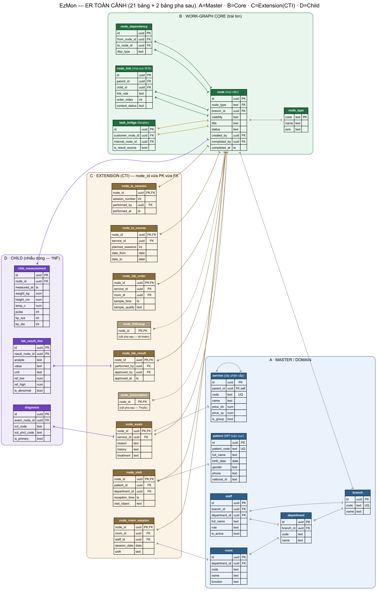

> Bản nét cao zoom thoải mái: [diagrams/08_er_full.svg](diagrams/08_er_full.svg) · nguồn [diagrams/08_er_full.dot](diagrams/08_er_full.dot).
> Ký hiệu quan hệ: đầu **chân quạ** = phía "nhiều", đầu **gạch ngang** = phía "một". Nét đứt = bảng pha sau. Cột thứ 3 trong mỗi bảng: `PK` khóa chính · `FK` khóa ngoại · `UQ` duy nhất.

### Danh mục chức năng từng bảng

**A · MASTER / DOMAIN** — dữ liệu nền, ít thay đổi
| Bảng | Chức năng (1 dòng) | Quan hệ chính |
|---|---|---|
| `branch` | Một chi nhánh/cơ sở. Gốc cô lập đa chi nhánh | ← department, staff, node |
| `department` | Một khoa (đơn vị tổ chức, chứa nhiều phòng) | → branch · ← room, staff |
| `room` | Một phòng (thuộc khoa); tạo bằng tool | → department · ← node_room_session, node_lab_order |
| `staff` | Một nhân viên (BS/KTV/điều dưỡng/lễ tân) | → branch, department |
| `patient` | Một bệnh nhân — **MPI toàn cục** (không gắn branch) | ← node_visit |
| `service` | Danh mục dịch vụ, **cây phân cấp** Nhóm→DV | → service (self) · ← node_exam, node_lab_order, node_tx_course |

**B · WORK-GRAPH CORE** — trái tim
| Bảng | Chức năng (1 dòng) | Quan hệ chính |
|---|---|---|
| `node_type` | Cấu hình các loại node (VISIT/EXAM/...) | ← node |
| `node` | **MỌI đơn vị việc** (worklist=task=subtask); cờ `visibility` | → node_type, branch, staff · ← gần như mọi bảng |
| `node_link` | Cạnh **cha-con M:N** trong 1 worklist; mang `link_role` + `order` | → node (parent), node (child) |
| `node_dependency` | Cạnh **"việc trước–sau"** (giữ DAG) | → node (from), node (to) |
| `task_bridge` | **Cầu facade** khách↔nội bộ (1:1 hoặc 1:N) | → node (customer), node (internal) |

**C · EXTENSION (CTI)** — `node_id` vừa PK vừa FK (1-1 với node)
| Bảng | Chức năng (1 dòng) | Quan hệ chính |
|---|---|---|
| `node_visit` | Phần riêng của **lượt khám** (BN, giờ tiếp nhận, đối tượng) | → node, patient, department |
| `node_room_session` | Phần riêng của **phiên phòng** (phòng, người trực, ngày) | → node, room, staff |
| `node_exam` | Phần riêng của **phiếu khám** (dịch vụ, lý do, bệnh sử, xử trí) | → node, service |
| `node_lab_order` | Phần riêng của **chỉ định XN** (dịch vụ, phòng, mẫu) | → node, service, room |
| `node_lab_result` | Phần riêng của **KQ XN** (người làm, người duyệt) | → node, staff×2 |
| `node_tx_course` | Phần riêng của **liệu trình** (dịch vụ, số buổi, từ–đến) | → node, service |
| `node_tx_session` | Phần riêng của **buổi điều trị** (số thứ tự buổi, người làm) | → node, staff |

**D · CHILD (nhiều dòng — 1NF)**
| Bảng | Chức năng (1 dòng) | Quan hệ chính |
|---|---|---|
| `diagnosis` | Một dòng **chẩn đoán ICD** của một phiếu khám | → node_exam |
| `lab_result_line` | Một dòng **chỉ số KQ XN** (WBC, RBC...) | → node_lab_result |
| `vital_measurement` | Một lần **đo sinh hiệu** (gắn node bất kỳ) | → node |

**Pha sau (chưa định cột)**
| Bảng | Chức năng | Quan hệ |
|---|---|---|
| `node_prescription` | Phần riêng đơn thuốc — module Thuốc | → node |
| `node_followup` | Phần riêng hẹn tái khám | → node |

> **Đọc cả bảng trong 1 câu:** 6 bảng nền (A) + 5 bảng đồ thị (B) gánh toàn bộ cấu trúc; 7 bảng C chỉ là "tờ đính kèm" cho từng loại việc; 3 bảng D là danh sách con. Thêm nghiệp vụ mới = thêm 1 `node_type` + (nếu cần) 1 bảng C. **Bốn bảng B không bao giờ phải sửa.**
```
